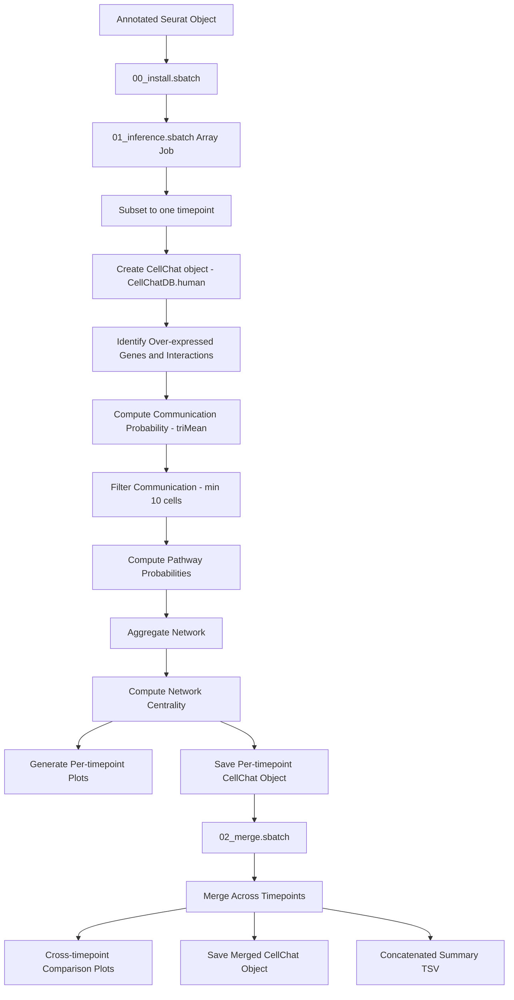

# CellChat Cell-Cell Communication Pipeline

A pipeline for inferring ligand-receptor mediated cell-cell communication networks from single-cell RNA-seq data across multiple time points using CellChat v2 in R.

## Table of Contents

- [Overview](#overview)
- [Directory Structure](#directory-structure)
- [Prerequisites](#prerequisites)
- [Configuration](#configuration)
- [Pipeline Workflow](#pipeline-workflow)
- [Usage](#usage)
- [Scripts Description](#scripts-description)
- [Output Files](#output-files)
- [Citation](#citation)

---

## Overview

This pipeline takes an annotated Seurat object from the Seurat pipeline and infers cell-cell communication for each experimental timepoint using CellChat v2. The pipeline:

- Runs per-timepoint CellChat inference in parallel via a SLURM array job (one task per timepoint)
- Identifies over-expressed signaling genes and interactions using the human ligand-receptor database
- Computes communication probabilities at both the ligand-receptor and pathway levels
- Aggregates interaction networks and computes network centrality scores per cell group
- Generates per-timepoint interaction circle plots, signaling role scatter plots, and pathway heatmaps
- Merges all timepoint objects to produce cross-timepoint comparison plots and a concatenated summary TSV

The pipeline is designed to run on HPC systems using SLURM job scheduling. CellChat, NMF, and presto are installed once via a dedicated install step as they are not available through conda (CellChat is GitHub-only; presto has no build for the r-base version; NMF requires a newer version than conda provides).

---

## Directory Structure

```
scripts/cellchat/
├── README.md                           # This file
├── run_pipeline.sh                     # Main pipeline orchestration script
│
├── Rscripts/                           # R analysis scripts
│   ├── install_packages.R              # One-time installation of GitHub dependencies
│   ├── inference_per_timepoint.R       # CellChat inference for one timepoint (array job)
│   └── merge_timepoints.R              # Merge per-timepoint objects and generate comparison plots
│
└── slurm/                              # SLURM batch scripts
    ├── 00_install.sbatch               # One-time dependency installation
    ├── 01_inference.sbatch             # Per-timepoint inference (array job, one task per timepoint)
    └── 02_merge.sbatch                 # Cross-timepoint merge and comparison plots
```

---

## Prerequisites

### Software Requirements

- R (tested with v4.5.3)
- SLURM workload manager
- Conda (for environment management)

### R Packages

- CellChat (v2.1.2, from GitHub: `jinworks/CellChat@v2.1.2`)
- NMF (v0.28.0, from CRAN — pinned version required by CellChat)
- presto (v1.0.0, from GitHub: `immunogenomics/presto@1.0.0`)
- Seurat (v5.5.0)
- future (v1.70.0, for parallelization)
- ComplexHeatmap (v2.26.1, for pathway heatmaps)

**Note**: CellChat is GitHub-only; presto has no build for the r-base conda version; NMF requires a newer version than conda provides. All three must be installed once using `00_install.sbatch` or `install_packages.R` before running the pipeline. Already-installed packages are skipped automatically.

### Input Data

- **Annotated Seurat object**: `<id>_processed.rds` from the Seurat pipeline, with `orig.ident` metadata column containing timepoint labels and a metadata column for cell grouping (default: `singler_cluster`)
- **Gene mapping**: `loc_map.tsv` used during Seurat preprocessing maps axolotl gene IDs to human symbols, enabling use of `CellChatDB.human`

---

## Configuration

### Setting up R environment

**Create environment from yml file**:
```bash
conda env create -f config/env_cellchat.yml
```

### Configuration Variables

**Default paths**

The pipeline uses configuration files in the `config/` directory. Default paths are defined in `config/default_paths.sh` and can be overridden in `config/local_paths.sh`.

**Main analysis variables**: Set in `run_pipeline.sh`:
```bash
export ID="all"                     # Analysis identifier (matches Seurat output)
export GROUP_BY="singler_cluster"   # Cell grouping column: singler_cluster | singler_label | seurat_clusters (default: "singler_cluster")
```

**Pipeline control flags**: Enable/disable individual steps in `run_pipeline.sh`:
```bash
install=true        # Run package installation
inference=true      # Run per-timepoint inference array job
merge=true          # Run cross-timepoint merge
```

### Input Data Organization

```
$OUT/seurat/
└── all_processed.rds                   # Annotated Seurat object from Seurat pipeline

$OUT/cellchat/<id>_<group_by>/          # Per-timepoint subdirectories (created by 01_inference.sbatch)
└── <id>_<tp>/
    └── <id>_<tp>_cellchat.rds
```

---

## Pipeline Workflow



---

## Usage

### Full Pipeline

```bash
# Navigate to the working directory
cd $WORK

# Run the complete pipeline
bash scripts/cellchat/run_pipeline.sh
```

Edit the control flags in `run_pipeline.sh` to enable or disable individual steps. On first run, set `install=true` and `inference=true`.

### Running Individual SLURM Scripts

Each SLURM batch script can be run independently with custom parameters:

#### 00_install.sbatch
Installs CellChat, NMF, and presto into the cellchat conda environment. Run once before the inference array job. Idempotent — skips packages already installed.

**Usage**:
```bash
sbatch scripts/cellchat/slurm/00_install.sbatch
```

---

#### 01_inference.sbatch
Runs per-timepoint CellChat inference as a SLURM array job. Each array task processes one timepoint (array index 0–7 maps to: control, 3h, 24h, 72h, 7dpa, 14dpa, 22dpa, 33dpa). Tasks for timepoints with fewer than 100 cells exit cleanly without failing.

**Parameters**:
- `ID`: Analysis identifier (default: "all")
- `GROUP_BY`: Any metadata column in the Seurat object to define cell groups (default: "singler_cluster")

**Usage**:
```bash
# Run all 8 timepoints (standard 8-timepoint experiment)
sbatch --array=0-7 scripts/cellchat/slurm/01_inference.sbatch

# Run with custom ID and grouping column
sbatch --array=0-7 --export=ALL,ID=all,GROUP_BY=seurat_clusters scripts/cellchat/slurm/01_inference.sbatch

# Run a single timepoint (e.g., control = index 0)
sbatch --array=0 scripts/cellchat/slurm/01_inference.sbatch
```

---

#### 02_merge.sbatch
Merges all per-timepoint CellChat objects and generates cross-timepoint comparison plots. Automatically discovers per-timepoint `.rds` files from the output of `01_inference.sbatch`. Requires at least 2 timepoints to produce comparison plots.

**Parameters**:
- `ID`: Analysis identifier (default: "all")
- `GROUP_BY`: Must match the value used in `01_inference.sbatch` — any metadata column in the Seurat object (default: "singler_cluster")

**Usage**:
```bash
# Run with defaults
sbatch scripts/cellchat/slurm/02_merge.sbatch

# Run with custom parameters
sbatch --export=ALL,ID=all,GROUP_BY=singler_cluster scripts/cellchat/slurm/02_merge.sbatch
```

---

### Running Individual R Scripts

```bash
# Run inference for one timepoint
Rscript scripts/cellchat/Rscripts/inference_per_timepoint.R \
  <id> <outdir> <input_rds> <group_by> <timepoint>

# Merge per-timepoint objects and generate comparison plots
Rscript scripts/cellchat/Rscripts/merge_timepoints.R <id> <outdir>
```

---

## Scripts Description

#### install_packages.R
**Purpose**: Install CellChat and GitHub-only dependencies into the conda environment. Run once before the inference array job.

**Packages installed**:
- `NMF` (v0.28.0) from CRAN — pinned version required by CellChat
- `CellChat` (v2.1.2) from GitHub
- `presto` (v1.0.0) from GitHub — requires `PKG_CXXFLAGS=-std=gnu++14`

**Usage**: `Rscript install_packages.R`

---

#### inference_per_timepoint.R
**Purpose**: Run the full CellChat v2 inference pipeline for a single timepoint.

**Method**:
- Subsets the Seurat object to the specified timepoint (`orig.ident == tp`)
- Drops empty factor levels from the grouping column (CellChat fails on empty levels)
- Creates a CellChat object using `CellChatDB.human` (axolotl gene symbols are already mapped to human)
- Identifies over-expressed signaling genes and L-R interactions
- Computes communication probability using `triMean` aggregation
- Filters interactions requiring at least 10 cells per group (`min.cells = 10`)
- Computes pathway-level probabilities, aggregates the network, and calculates centrality scores
- Uses 16-core multicore parallelization via the future package (48 GB memory limit)

**Usage**: `Rscript inference_per_timepoint.R <id> <outdir> <input_rds> <group_by> <tp>`

**Output**:
- `<tp_id>_interactions_count.png`: Circle plot of interaction counts between cell groups
- `<tp_id>_interactions_weight.png`: Circle plot of interaction strength between cell groups
- `<tp_id>_signaling_role.png`: Scatter plot of outgoing vs incoming signaling strength per cell group
- `<tp_id>_pathway_heatmap_outgoing.png`: Heatmap of outgoing signaling patterns by pathway and cell group
- `<tp_id>_pathway_heatmap_incoming.png`: Heatmap of incoming signaling patterns by pathway and cell group
- `<tp_id>_cellchat.rds`: Per-timepoint CellChat object
- `<tp_id>_cellchat_summary.tsv`: One-row summary of inference statistics

---

#### merge_timepoints.R
**Purpose**: Load all per-timepoint CellChat objects, merge them, and generate cross-timepoint comparison plots.

**Method**:
- Discovers per-timepoint `.rds` files in `<id>_<tp>/<id>_<tp>_cellchat.rds` under the output directory
- Merges with `mergeCellChat()` in canonical timepoint order (control → 33dpa)
- Generates comparison plots using `compareInteractions()` and `rankNet()`

**Note**: `rankNet()` is called with `do.stat = FALSE` because per-timepoint objects have different L-R pair sets; significance testing requires matched pairs.

**Usage**: `Rscript merge_timepoints.R <id> <outdir>`

**Output**:
- `<id>_compare_interactions_count.png`: Bar plot of total interaction counts across timepoints
- `<id>_compare_interactions_weight.png`: Bar plot of total interaction strength across timepoints
- `<id>_rank_net.png`: Stacked bar plot of pathway information flow ranked across timepoints
- `<id>_cellchat_merged.rds`: Merged CellChat object
- `<id>_cellchat_summary.tsv`: Concatenated per-timepoint summary rows

---

## Output Files

### File Naming Convention

Per-timepoint outputs are written to `$OUT/cellchat/<id>_<group_by>/<id>_<tp>/` and use `<id>_<tp>` as the prefix (e.g., `all_control`). Cross-timepoint comparison outputs use `<id>` as the prefix (e.g., `all`) and are written to the root `$OUT/cellchat/<id>_<group_by>/` directory.

Examples:
- `all_singler_cluster/all_control/all_control_cellchat.rds`
- `all_singler_cluster/all_control/all_control_interactions_count.png`
- `all_singler_cluster/all_cellchat_merged.rds`
- `all_singler_cluster/all_cellchat_summary.tsv`

### Output Directory Structure

```
$OUT/cellchat/
└── all_singler_cluster/
    ├── all_compare_interactions_count.png  # Cross-timepoint total interaction count
    ├── all_compare_interactions_weight.png # Cross-timepoint total interaction strength
    ├── all_rank_net.png                    # Pathway information flow ranking across timepoints
    ├── all_cellchat_merged.rds             # Merged CellChat object
    ├── all_cellchat_summary.tsv            # Concatenated per-timepoint summary
    │
    ├── all_control/
    │   ├── all_control_interactions_count.png
    │   ├── all_control_interactions_weight.png
    │   ├── all_control_signaling_role.png
    │   ├── all_control_pathway_heatmap_outgoing.png
    │   ├── all_control_pathway_heatmap_incoming.png
    │   ├── all_control_cellchat.rds
    │   └── all_control_cellchat_summary.tsv
    ├── all_3h/
    │   └── ...
    ├── all_24h/
    │   └── ...
    └── all_33dpa/
        └── ...
```

### Key Output Files

| File | Description |
|------|-------------|
| `*_cellchat.rds` | Per-timepoint CellChat object with all inference results |
| `*_cellchat_merged.rds` | Merged object across all timepoints for cross-timepoint analysis |
| `*_interactions_count.png` | Circle plot: number of L-R interactions between cell groups |
| `*_interactions_weight.png` | Circle plot: aggregated interaction strength between cell groups |
| `*_signaling_role.png` | Scatter plot: outgoing vs incoming signaling per cell group |
| `*_pathway_heatmap_outgoing.png` | Heatmap: which cell groups send which pathway signals |
| `*_pathway_heatmap_incoming.png` | Heatmap: which cell groups receive which pathway signals |
| `*_compare_interactions_count.png` | Bar plot: total interaction count per timepoint |
| `*_compare_interactions_weight.png` | Bar plot: total interaction strength per timepoint |
| `*_rank_net.png` | Stacked bar: pathway information flow ranked across timepoints |
| `*_cellchat_summary.tsv` | Summary statistics per timepoint |

### Summary TSV Fields

| Field | Description |
|-------|-------------|
| `id` | Timepoint analysis identifier (`<id>_<tp>`) |
| `timepoint` | Experimental timepoint |
| `group_by` | Metadata column used for cell grouping |
| `n_cells` | Total cells in this timepoint |
| `n_groups` | Number of cell groups present in this timepoint |
| `n_signaling_genes` | Number of over-expressed signaling genes identified |
| `n_LR_pairs` | Number of over-expressed L-R pairs identified |
| `n_significant_LR` | Number of L-R interactions with p < 0.05 |
| `n_signaling_pathways` | Number of active signaling pathways |

---

## Citation

- **CellChat**: Jin, S., Guerrero-Juarez, C.F., Zhang, L., Chang, I., Ramos, R., Kuan, C.H., Myung, P., Plikus, M.V., & Nie, Q. (2021). Inference and analysis of cell-cell communication using CellChat. *Nature Communications, 12*(1), 1088. https://doi.org/10.1038/s41467-021-21246-9

- **CellChat v2**: Jin, S., Plikus, M.V., & Bhatt, D.L. (2024). CellChat for systematic analysis of cell-cell communication from single-cell transcriptomics. *Nature Protocols*. https://doi.org/10.1038/s41596-024-01045-4

- **presto**: Kowalski, M.H., Yofe, I., Chang, S., Moriel, N., Ramsköld, D., Bhatt, D.L., Satija, R., & Amit, I. (2019). Single-cell transcriptomics of human immune cell landscapes reveals cell-type-specific signatures of a healthy aging response. *bioRxiv*. https://doi.org/10.1101/653253

---

**Last Updated**: 2026-05-04
