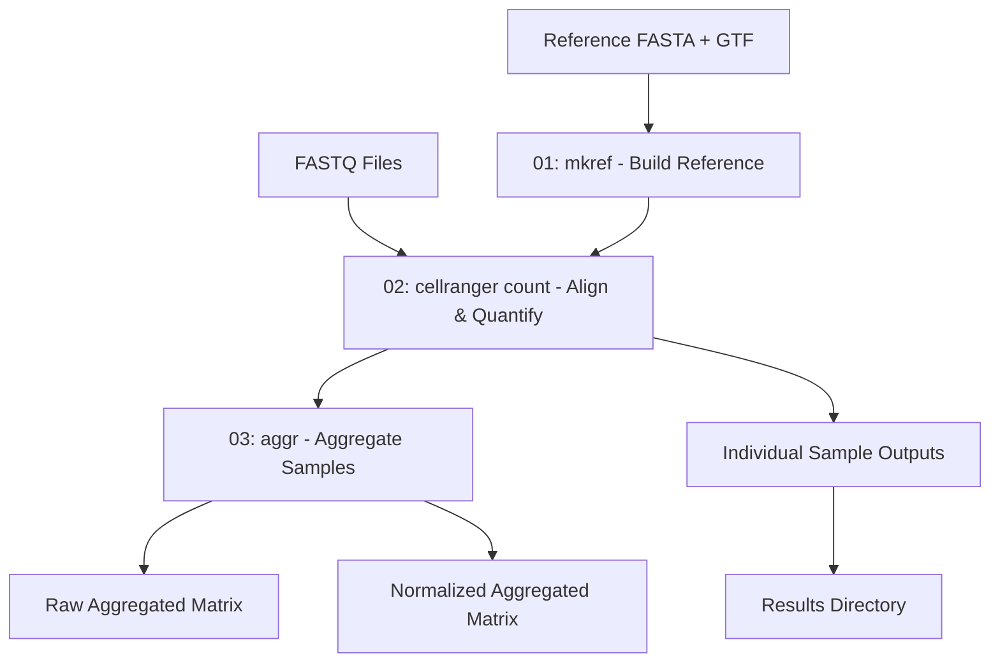

# Cell Ranger Single-Cell RNA-seq Alignment Pipeline

A comprehensive pipeline for processing single-cell RNA-seq data using 10X Genomics Cell Ranger software on HPC systems.

## Table of Contents

- [Overview](#overview)
- [Directory Structure](#directory-structure)
- [Prerequisites](#prerequisites)
- [Configuration](#configuration)
- [Pipeline Workflow](#pipeline-workflow)
- [Usage](#usage)
- [Scripts Description](#scripts-description)
- [Output Files](#output-files)
- [Citation](#citation)

---

## Overview

This pipeline processes 10X Genomics single-cell RNA-seq FASTQ files through the Cell Ranger workflow including:

- Reference genome preparation (`mkref`)
- Read alignment and quantification (`count`)
- Sample aggregation with normalization (`aggr --normalize=mapped`)
- Sample aggregation without normalization (`aggr --normalize=none`)

The pipeline is designed to run on HPC systems using SLURM job scheduling and processes data from multiple experimental timepoints across different reference genomes.

---

## Directory Structure

```
scripts/cellranger/
├── README.md                      # This file
├── run_pipeline.sh                # Automated pipeline execution script
├── gtf_remove_whitespace.sh       # Utility for cleaning GTF files (AmexG reference only)
│
└── slurm/                         # SLURM batch scripts
    ├── 01_mkref.sbatch            # Build reference genomes
    ├── 02_cellranger.sbatch       # Align and quantify reads
    └── 03_aggr.sbatch             # Aggregate samples
```

---

## Prerequisites

### Software Requirements

- Cell Ranger (tested with v9.0.1)
- SLURM workload manager

### Cell Ranger Installation

Cell Ranger is provided as a pre-compiled binary and does not require compilation or installation of dependencies.

**Installation Steps:**

```bash
# Download Cell Ranger (example for v9.0.1)
cd /path/to/software
curl -o cellranger-9.0.1.tar.gz "https://cf.10xgenomics.com/releases/cell-exp/cellranger-9.0.1.tar.gz"

# Extract the tarball
tar -xzvf cellranger-9.0.1.tar.gz

# Add Cell Ranger to your PATH
export PATH=/path/to/software/cellranger-9.0.1:$PATH

# Verify installation
cellranger --version
# Should output: cellranger cellranger-9.0.1
```

**Making PATH changes permanent:**

Add the export line to your shell configuration file:
```bash
# For bash
echo 'export PATH=/path/to/software/cellranger-9.0.1:$PATH' >> ~/.bashrc
source ~/.bashrc

# For other shells, add to the appropriate file (~/.bash_profile, ~/.zshrc, etc.)
```

**System Requirements:**
- 8-core Intel or AMD processor (16+ cores recommended)
- 64 GB RAM minimum (128+ GB recommended for large datasets)
- 1 TB free disk space

**Download Links:**
- Latest version: https://support.10xgenomics.com/single-cell-gene-expression/software/downloads/latest
- All versions: https://support.10xgenomics.com/single-cell-gene-expression/software/downloads/

**Documentation:**
- User Guide: https://support.10xgenomics.com/single-cell-gene-expression/software/pipelines/latest/what-is-cell-ranger

### Input Data

- **10X Genomics FASTQ files**: Illumina sequencing data from Chromium platform
- **Reference genome FASTA**: Genomic sequence file (`.fna` or `.fa`)
- **Gene annotation GTF**: Gene annotations (`.gtf`)

---

## Configuration

### Configuration Files

The pipeline uses two configuration files in the `config/` directory:

1. **`config/default_paths.sh`**: Default configuration template (tracked in git)
2. **`config/local_paths.sh`**: Local overrides for your system (optional, not tracked in git)

All scripts source both files in order:
```bash
source "config/default_paths.sh"
[ -f "config/local_paths.sh" ] && source "config/local_paths.sh"
```

Variables defined in `local_paths.sh` override those in `default_paths.sh`.

### Default Configuration

The `config/default_paths.sh` file contains:

```bash
#!/bin/bash

# Working directory (project root)
export WORK="$(readlink -f .)"

# Data directory
export DATA="$WORK/data"
export FQ_src="$DATA/Li_dataset"
export FQ_names=("0HPA" "3HPA" "1DPA" "3DPA" "7DPA" "14DPA" "22DPA" "33DPA")
export SMPS=("control" "3h" "24h" "72h" "7dpa" "14dpa" "22dpa" "33dpa")

# Reference genome files directory
export REF_FILES="$DATA/ref_files"
export FA_names=("GCF_040938575.1_UKY_AmexF1_1_genomic.fna" "AmexG_v6.0-DD.fa")
export GTF_names=("GCF_040938575.1_UKY_AmexF1_1_genomic.gtf" "AmexT_v47-AmexG_v6.0-DD.noWS.gtf")
export REF_names=("UKY_AmexF1_1_genomic" "AmexT_v47-AmexG_v6_0-DD")

# Outputs directory
export OUT="$WORK/outputs"

# Logs directory
export LOG="$WORK/logs"
```

### Customizing for Your System

To customize paths for your system:

1. **Copy the default configuration:**
   ```bash
   cp config/default_paths.sh config/local_paths.sh
   ```

2. **Edit `config/local_paths.sh`** to set your specific paths:
   ```bash
   export WORK="$HOME/your-project-directory"
   export DATA="/path/to/your/data"
   export SCRATCH="/path/to/your/scratch"
   export OUT="$SCRATCH/outputs"
   # ... modify other paths as needed
   ```

3. **Do not commit `local_paths.sh`** (it's in `.gitignore`)

### Configuration Variables

| Variable | Description | Default Value |
|----------|-------------|---------------|
| `WORK` | Project root directory | Current directory |
| `DATA` | Data storage location | `$WORK/data` |
| `OUT` | Pipeline outputs directory | `$WORK/outputs` |
| `LOG` | Job log files directory | `$WORK/logs` |
| `FQ_src` | FASTQ files parent directory | `$DATA/Li_dataset` |
| `FQ_names` | FASTQ subdirectory names (array) | `("0HPA" "3HPA" "1DPA" ...)` |
| `SMPS` | Sample names for pipeline (array) | `("control" "3h" "24h" ...)` |
| `REF_FILES` | Reference genome files directory | `$DATA/ref_files` |
| `FA_names` | FASTA filenames (array) | `("...genomic.fna" "...DD.fa")` |
| `GTF_names` | GTF filenames (array) | `("...genomic.gtf" "...DD.noWS.gtf")` |
| `REF_names` | Reference names for output (array) | `("UKY_AmexF1_1_genomic" ...)` |

**Important Notes:**

- **Sample Name Mapping**:
  - `FQ_names` = Directory names where FASTQ files are stored (e.g., "0HPA")
  - `SMPS` = Corresponding sample names used in the pipeline (e.g., "control")
  - Arrays must be the same length and in matching order
  - Example: `FQ_names[0]="0HPA"` → `SMPS[0]="control"`

- **Array Lengths**: All array variables must have consistent indices for proper sample-reference pairing

### Input Data Organization

Based on default configuration, organize your data as:

```
$WORK/
├── data/
│   ├── Li_dataset/                 # $FQ_src
│   │   ├── 0HPA/                   # FQ_names[0] → SMPS[0]="control"
│   │   ├── 3HPA/                   # FQ_names[1] → SMPS[1]="3h"
│   │   ├── 1DPA/                   # FQ_names[2] → SMPS[2]="24h"
│   │   ├── 3DPA/                   # FQ_names[3] → SMPS[3]="72h"
│   │   ├── 7DPA/                   # FQ_names[4] → SMPS[4]="7dpa"
│   │   ├── 14DPA/                  # FQ_names[5] → SMPS[5]="14dpa"
│   │   ├── 22DPA/                  # FQ_names[6] → SMPS[6]="22dpa"
│   │   └── 33DPA/                  # FQ_names[7] → SMPS[7]="33dpa"
│   │
│   └── ref_files/                  # $REF_FILES
│       ├── GCF_040938575.1_UKY_AmexF1_1_genomic.fna
│       ├── GCF_040938575.1_UKY_AmexF1_1_genomic.gtf
│       ├── AmexG_v6.0-DD.fa
│       └── AmexT_v47-AmexG_v6.0-DD.noWS.gtf
│
├── outputs/                        # $OUT (created by pipeline)
└── logs/                           # $LOG (created by pipeline)
```

### GTF Preprocessing (AmexG Reference Only)

The AmexG reference GTF requires whitespace removal before use with Cell Ranger:

```bash
# Only needed if you have the original AmexT_v47-AmexG_v6.0-DD.gtf
# The pipeline expects AmexT_v47-AmexG_v6.0-DD.noWS.gtf (already processed)

cd $DATA/ref_files
bash $WORK/scripts/cellranger/gtf_remove_whitespace.sh AmexT_v47-AmexG_v6.0-DD.gtf

# This creates: AmexT_v47-AmexG_v6.0-DD.noWS.gtf
```

**Note:** The UKY_AmexF1_1 GTF does not require preprocessing.

---

## Pipeline Workflow



### Array Job Indexing

The pipeline uses SLURM array jobs to process multiple samples in parallel:

**02_cellranger.sbatch** (array=0-15):
- Total jobs: 16 = 2 reference genomes × 8 timepoints
- Index calculation:
  ```bash
  ref_idx = ARRAY_TASK_ID / 8    # Which reference (0 or 1)
  fq_idx = ARRAY_TASK_ID % 8     # Which timepoint (0-7)
  ```
- Example:
  - Task 0: ref_idx=0 (UKY_AmexF1_1), fq_idx=0 (0HPA/control)
  - Task 8: ref_idx=1 (AmexG), fq_idx=0 (0HPA/control)
  - Task 9: ref_idx=1 (AmexG), fq_idx=1 (3HPA/3h)

**03_aggr.sbatch** (array=0-3):
- Total jobs: 4 = 2 reference genomes × 2 normalization methods
- Index calculation:
  ```bash
  ref_idx = ARRAY_TASK_ID / 2    # Which reference (0 or 1)
  norm_idx = ARRAY_TASK_ID % 2   # Normalization (0=none, 1=mapped)
  ```
- Jobs:
  - Task 0: UKY_AmexF1_1, no normalization (raw)
  - Task 1: UKY_AmexF1_1, with normalization
  - Task 2: AmexG, no normalization (raw)
  - Task 3: AmexG, with normalization

---

## Usage

### Automated Pipeline Execution (Recommended)

The `run_pipeline.sh` script automates the entire pipeline with proper job dependencies:

```bash
# Run from project root directory
bash scripts/cellranger/run_pipeline.sh
```

This script will:
1. Submit the reference genome building job (array 0-1)
2. Submit Cell Ranger count (array 0-15) with dependency on Step 1
3. Submit aggregation jobs (array 0-3) with dependency on Step 2
4. Display all submitted job IDs for tracking

Log files are created in `$LOG/` with format: `{job_name}_{job_id}_{array_id}.log`

### Manual Pipeline Execution

You can also run individual steps manually:

```bash
# Step 1: Build reference genomes (creates 2 references)
sbatch scripts/cellranger/slurm/01_mkref.sbatch

# Step 2: Process samples (16 jobs: 2 refs × 8 samples)
# Wait for Step 1 to complete
sbatch scripts/cellranger/slurm/02_cellranger.sbatch

# Step 3: Aggregate samples (4 jobs: 2 refs × 2 norm methods)
# Wait for Step 2 to complete
sbatch scripts/cellranger/slurm/03_aggr.sbatch
```

### Monitoring Jobs

```bash
# Check job status
squeue -u $USER

# View log files
tail -f $LOG/mkref_*.log
tail -f $LOG/cellranger_*_0.log
tail -f $LOG/aggr_*.log
```

---

## Scripts Description

### 01_mkref.sbatch

**Purpose**: Build Cell Ranger-compatible reference genomes from FASTA and GTF files.

**SLURM Configuration**:
- `--array=0-1`: Processes 2 reference genomes in parallel
- `--cpus-per-task=16`: CPU threads for indexing
- `--mem=180G`: Memory allocation
- `--time=24:00:00`: Maximum runtime

**Cell Ranger Parameters**:
- `--nthreads=16`: Number of CPU threads
- `--memgb`: Memory in GB (total - 20GB buffer)

**Input**: FASTA and GTF files from `$REF_FILES`

**Output**: Reference genome directories in `$DATA/ref_genomes/cellranger_mkref/`
- `$DATA/ref_genomes/cellranger_mkref/UKY_AmexF1_1_genomic/`
- `$DATA/ref_genomes/cellranger_mkref/AmexT_v47-AmexG_v6_0-DD/`

---

### 02_cellranger.sbatch

**Purpose**: Align reads and quantify gene expression using Cell Ranger count.

**SLURM Configuration**:
- `--array=0-15`: Processes 16 sample-reference combinations
  - Indices 0-7: UKY_AmexF1_1 × 8 samples
  - Indices 8-15: AmexG_v6_0-DD × 8 samples
- `--cpus-per-task=4`: CPU cores per job
- `--mem=240G`: Memory per job
- `--time=24:00:00`: Maximum runtime

**Cell Ranger Parameters**:
- `--create-bam=false`: Skip BAM file creation (saves space)
- `--nosecondary`: Skip secondary analysis (clustering, etc.)
- `--localcores=4`: CPU cores to use
- `--localmem`: Memory in GB (total - 20GB buffer)

**Input**: FASTQ files from `$FQ_src/{FQ_names[i]}/`

**Output** (per sample):
- `$OUT/cellranger/ref_{REF}/sample/outs/filtered_feature_bc_matrix/`: Count matrix
- `$OUT/cellranger/ref_{REF}/sample/outs/molecule_info.h5`: Molecule data
- `$OUT/cellranger/ref_{REF}/sample/outs/web_summary.html`: QC report

**Results Copy**: Web summary copied to `$WORK/results/cellranger/ref_{REF}/sample/`

---

### 03_aggr.sbatch

**Purpose**: Aggregate multiple samples with or without depth normalization.

**SLURM Configuration**:
- `--array=0-3`: Processes 4 combinations
  - Index 0: UKY_AmexF1_1, no normalization
  - Index 1: UKY_AmexF1_1, with normalization
  - Index 2: AmexG_v6_0-DD, no normalization
  - Index 3: AmexG_v6_0-DD, with normalization
- `--cpus-per-task=16`: CPU cores
- `--mem=180G`: Memory allocation
- `--time=2:00:00`: Maximum runtime

**Cell Ranger Parameters**:
- `--normalize=none`: No depth normalization (raw counts)
- `--normalize=mapped`: Depth normalize across samples
- `--disable-ui`: Disable Loupe browser UI
- `--localcores=16`: CPU cores to use
- `--localmem`: Memory in GB (total - 20GB buffer)

**Input**:
- Requires `aggr_samples.csv` in `$OUT/cellranger/ref_{REF}/`
- CSV format:
  ```csv
  library_id,molecule_h5
  control,/path/to/control/outs/molecule_info.h5
  3h,/path/to/3h/outs/molecule_info.h5
  24h,/path/to/24h/outs/molecule_info.h5
  72h,/path/to/72h/outs/molecule_info.h5
  7dpa,/path/to/7dpa/outs/molecule_info.h5
  14dpa,/path/to/14dpa/outs/molecule_info.h5
  22dpa,/path/to/22dpa/outs/molecule_info.h5
  33dpa,/path/to/33dpa/outs/molecule_info.h5
  ```

**Output**:
- Raw: `$OUT/cellranger/ref_{REF}/aggr_samples_raw/outs/count/filtered_feature_bc_matrix/`
- Normalized: `$OUT/cellranger/ref_{REF}/aggr_samples_normalized/outs/count/filtered_feature_bc_matrix/`

---

## Output Files

### Directory Structure

```
$OUT/
└── cellranger/
    ├── ref_UKY_AmexF1_1_genomic/
    │   ├── control/
    │   │   └── outs/
    │   │       ├── filtered_feature_bc_matrix/
    │   │       │   ├── barcodes.tsv.gz
    │   │       │   ├── features.tsv.gz
    │   │       │   └── matrix.mtx.gz
    │   │       ├── molecule_info.h5
    │   │       ├── web_summary.html
    │   │       └── metrics_summary.csv
    │   ├── 3h/
    │   ├── 24h/
    │   ├── 72h/
    │   ├── 7dpa/
    │   ├── 14dpa/
    │   ├── 22dpa/
    │   ├── 33dpa/
    │   ├── aggr_samples_raw/
    │   │   └── outs/count/filtered_feature_bc_matrix/
    │   └── aggr_samples_normalized/
    │       └── outs/count/filtered_feature_bc_matrix/
    │
    └── ref_AmexT_v47-AmexG_v6_0-DD/
        └── (same structure as above)

$WORK/
└── results/
    └── cellranger/
        ├── ref_UKY_AmexF1_1_genomic/
        │   ├── control/web_summary.html
        │   ├── 3h/web_summary.html
        │   └── ... (all samples)
        └── ref_AmexT_v47-AmexG_v6_0-DD/
            └── (same structure)

$DATA/
└── ref_genomes/
    └── cellranger_mkref/
        ├── UKY_AmexF1_1_genomic/
        │   ├── reference.json
        │   ├── fasta/
        │   ├── genes/
        │   └── star/
        └── AmexT_v47-AmexG_v6_0-DD/
            └── (same structure)
```

### Key Output Files

| File | Description |
|------|-------------|
| **Reference Outputs** | |
| `reference.json` | Reference genome metadata |
| `star/` | STAR aligner index files |
| `fasta/genome.fa` | Processed genome sequence |
| `genes/genes.gtf` | Processed gene annotations |
| **Count Outputs (per sample)** | |
| `filtered_feature_bc_matrix/` | Gene-barcode UMI count matrix (main output) |
| `barcodes.tsv.gz` | Cell barcodes passing filters |
| `features.tsv.gz` | Gene IDs and names |
| `matrix.mtx.gz` | Sparse UMI count matrix (Market Matrix format) |
| `molecule_info.h5` | Molecule-level data for aggregation |
| `web_summary.html` | Interactive QC report with plots |
| `metrics_summary.csv` | Key metrics in CSV format |
| **Aggregation Outputs** | |
| `count/filtered_feature_bc_matrix/` | Combined count matrix from all samples |
| `aggregation.csv` | Sample metadata and normalization factors |

### Results Directory

The `results/` directory contains copies of web summary reports for easy access:
- Location: `$WORK/results/cellranger/`
- Contents: Web summary HTML files for all samples
- Updated after each count job completes
- Useful for quick QC review without navigating full output structure

---

## Citation

- **Cell Ranger**: 10X Genomics. (2023). Cell Ranger Software. https://support.10xgenomics.com/single-cell-gene-expression/software/pipelines/latest/what-is-cell-ranger

- **10X Genomics Chromium**: Zheng, G.X.Y., Terry, J.M., Belgrader, P., et al. (2017). Massively parallel digital transcriptional profiling of single cells. Nature Communications, 8, 14049.

---

**Last Updated**: 2025-12-09
