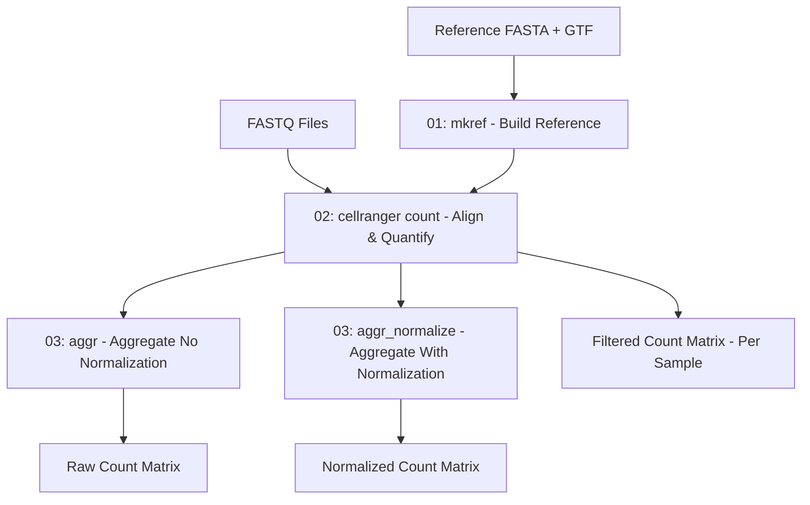

# Cell Ranger Single-Cell RNA-seq Alignment Pipeline

A comprehensive pipeline for processing single-cell RNA-seq data using 10X Genomics Cell Ranger software on HPC systems.

## Table of Contents

- [Overview](#overview)
- [Directory Structure](#directory-structure)
- [Prerequisites](#prerequisites)
- [Installation](#installation)
- [Pipeline Workflow](#pipeline-workflow)
- [Usage](#usage)
- [Scripts Description](#scripts-description)
- [Output Files](#output-files)
- [Citation](#citation)

## Overview

This pipeline processes 10X Genomics single-cell RNA-seq FASTQ files through the Cell Ranger workflow including:

- Reference genome preparation (`mkref`)
- Read alignment and quantification (`count`)
- Sample aggregation without normalization (`aggr --normalize=none`)
- Sample aggregation with normalization (`aggr`)

The pipeline is designed to run on HPC systems using SLURM job scheduling and processes data from multiple experimental time points across different reference genomes.

## Directory Structure

```
scripts/cellranger/
├── README.md                      # This file
│
└── slurm/                         # SLURM batch scripts
    ├── 01_mkref.sbatch            # Build reference genomes
    ├── 02_cellranger.sbatch       # Align and quantify reads
    ├── 03_aggr.sbatch             # Aggregate samples (no normalization)
    └── 03_aggr_normalize.sbatch   # Aggregate samples (with normalization)
```

## Prerequisites

### Software Requirements

- Cell Ranger (tested with v9.0.1)
- SLURM workload manager

### Input Data

- **10X Genomics FASTQ files**: Illumina sequencing data from Chromium platform
- **Reference genome FASTA**: Genomic sequence file (`.fna` or `.fa`)
- **Gene annotation GTF**: Gene annotations (`.gtf`)

## Installation

### 1. Download Cell Ranger

```bash
# Download Cell Ranger from 10X Genomics
wget https://cf.10xgenomics.com/releases/cell-exp/cellranger-9.0.1.tar.gz

# Extract the tarball
tar -xzvf cellranger-9.0.1.tar.gz
```

### 2. Add Cell Ranger to PATH
```bash
# Add Cell Ranger installation directory to your PATH
export PATH=/path/to/cellranger-9.0.1:$PATH
```

### 3. Configure paths

Edit the SLURM scripts to set your directory paths:

```bash
SCRATCH="/path/to/scratch"	# Scratch directory for processing
DATA="/path/to/data"            # Data directory for storage
```

### 4. Prepare input data

Ensure your data is organized as:

```
$SCRATCH/
├── ref_genomes/
│   └── ref_files/
│       ├── genome1.fna
│       ├── genome1.gtf
│       ├── genome2.fa
│       └── genome2.gtf
│
└── Li_dataset/                      # FASTQ directory
    ├── 0HPA/
    ├── 3HPA/
    ├── 1DPA/
    └── ...
```

## Pipeline Workflow



## Usage

### Full Pipeline

```bash
# Step 1: Build reference genomes
sbatch scripts/cellranger/slurm/01_mkref.sbatch

# Step 2: Process samples
sbatch scripts/cellranger/slurm/02_cellranger.sbatch

# Step 3a: Aggregate without normalization (optional)
sbatch scripts/cellranger/slurm/03_aggr.sbatch

# Step 3b: Aggregate with normalization (optional)
sbatch scripts/cellranger/slurm/03_aggr_normalize.sbatch
```

### Running Individual Steps

Each script can be run independently:

## Scripts Description

### 01_mkref.sbatch

**Purpose**: Build Cell Ranger-compatible reference genomes from FASTA and GTF files.

**Parameters**:
- `--nthreads = 16`: Number of CPU threads
- `--memgb = 40`: Memory in GB (60GB total - 20GB buffer)

**Usage**: `sbatch scripts/cellranger/slurm/01_mkref.sbatch`

**Output**: Reference genome directories in `$SCRATCH/ref_genomes/cellranger_mkref/`

---

### 02_cellranger.sbatch

**Purpose**: Align reads and quantify gene expression using Cell Ranger count.

**Parameters**:
- `--create-bam = false`: Skip BAM creation
- `--nosecondary`: Skip secondary analysis
- `--localcores = 4`: Number of CPU cores
- `--localmem = 180`: Memory in GB

**Usage**: `sbatch scripts/cellranger/slurm/02_cellranger.sbatch`

**Output**: 
- `filtered_feature_bc_matrix/`: Gene-barcode UMI count matrix
- `molecule_info.h5`: Molecule-level information for aggregation
- `web_summary.html`: QC metrics and visualizations

---

### 03_aggr.sbatch

**Purpose**: Aggregate multiple samples without depth normalization.

**Parameters**:
- `--normalize = none`: Disable depth normalization
- `--disable-ui`: Disable User Interface
- `--localcores = 28`: Number of CPU cores
- `--localmem = 160`: Memory in GB

**Input**: Requires `aggr_samples.csv` with sample paths

**CSV format**:
```csv
library_id,molecule_h5
control,/path/to/control/outs/molecule_info.h5
3h,/path/to/3h/outs/molecule_info.h5
```

**Usage**: `sbatch scripts/cellranger/slurm/03_aggr.sbatch`

**Output**: Combined count matrix in `aggr_samples_raw/outs/count/filtered_feature_bc_matrix/`

---

### 03_aggr_normalize.sbatch

**Purpose**: Aggregate multiple samples with depth normalization enabled.

**Parameters**:
- Normalization method: `mapped` (default)
- `--disable-ui`: Disable User Interface
- `--localcores = 28`: Number of CPU cores
- `--localmem = 160`: Memory in GB

**Input**: Requires `aggr_samples.csv` with sample paths

**CSV format**:
```csv
library_id,molecule_h5
control,/path/to/control/outs/molecule_info.h5
3h,/path/to/3h/outs/molecule_info.h5
```

**Usage**: `sbatch scripts/cellranger/slurm/03_aggr_normalize.sbatch`

**Output**: Combined count matrix in `aggr_samples/outs/count/filtered_feature_bc_matrix/`

## Output Files

### File Naming Convention

Output directories follow the pattern: `<sample_or_aggr_id>/outs/filtered_feature_bc_matrix/`

Example: `control/outs/filtered_feature_bc_matrix/`

### Output Directory Structure

```
$SCRATCH/outputs/ref_<genome>/cellranger/
└── <sample>/
    └── outs/
        ├── filtered_feature_bc_matrix/
        │   ├── barcodes.tsv.gz
        │   ├── features.tsv.gz
        │   └── matrix.mtx.gz
        ├── filtered_feature_bc_matrix.h5
        ├── raw_feature_bc_matrix/
        │   ├── barcodes.tsv.gz
        │   ├── features.tsv.gz
        │   └── matrix.mtx.gz
        ├── raw_feature_bc_matrix.h5
        ├── molecule_info.h5
        ├── web_summary.html
        └── metrics_summary.csv
```

### Key Output Files

| File | Description |
|------|-------------|
| **Reference Outputs** | |
| `reference.json` | Reference genome metadata |
| `star/` | STAR aligner index files |
| **Count Outputs** | |
| `filtered_feature_bc_matrix/` | Gene-barcode UMI count matrix (main output) |
| `barcodes.tsv.gz` | Cell barcodes |
| `features.tsv.gz` | Gene information |
| `matrix.mtx.gz` | Sparse count matrix |
| `molecule_info.h5` | Molecule-level data for aggregation |
| `web_summary.html` | Interactive QC report |
| `metrics_summary.csv` | Key metrics in CSV format |
| **Aggregation Outputs** | |
| `count/filtered_feature_bc_matrix/` | Combined count matrix from all samples |
| `aggregation.csv` | Sample metadata and normalization factors |

---

## Citation

- **Cell Ranger**: 10X Genomics. Cell Ranger Software. https://www.10xgenomics.com/support/software/cell-ranger
- **10X Genomics Chromium**: Zheng, G.X., Terry, J.M., et al. (2017). Massively parallel digital transcriptional profiling of single cells. Nature Communications, 8, 14049.

---

**Last Updated**: 2025-11-20
