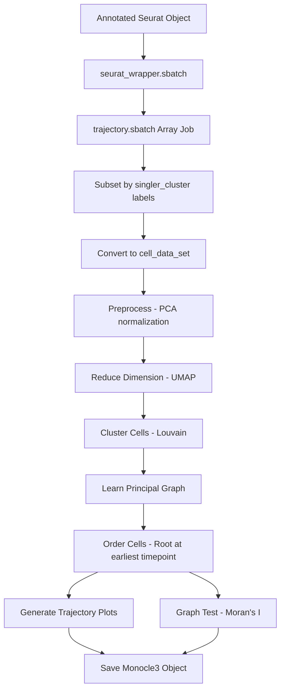

# Monocle3 Trajectory Inference Pipeline

A pipeline for pseudotime trajectory analysis of single-cell RNA-seq data from multiple time points using Monocle3 in R.

## Table of Contents

- [Overview](#overview)
- [Directory Structure](#directory-structure)
- [Prerequisites](#prerequisites)
- [Configuration](#configuration)
- [Pipeline Workflow](#pipeline-workflow)
- [Usage](#usage)
- [Scripts Description](#scripts-description)
- [Output Files](#output-files)
- [Lineages File](#lineages-file)
- [Citation](#citation)

---

## Overview

This pipeline infers pseudotime trajectories from an annotated Seurat object produced by the Seurat pipeline. Each lineage is processed independently so that preprocessing, UMAP embedding, and pseudotime scale reflect only the cells in that lineage. The pipeline:

- Subsets cells by lineage using SingleR cluster-level annotations (`singler_cluster`)
- Converts each lineage subset to a Monocle3 `cell_data_set`
- Normalizes, reduces dimensions (PCA + UMAP), and clusters within each lineage
- Learns a principal graph and assigns pseudotime anchored at the earliest present timepoint
- Tests for genes with expression that varies along the principal graph (Moran's I)
- Generates trajectory plots colored by pseudotime, timepoint, and cell type annotations
- Saves the Monocle3 object and a per-lineage summary TSV

The pipeline is designed to run on HPC systems using SLURM job scheduling and processes lineages in parallel via array jobs.

---

## Directory Structure

```
scripts/monocle3/
├── README.md                       # This file
├── run_pipeline.sh                 # Main pipeline orchestration script
├── lineages.txt                    # Lineage definitions (name=clusters)
│
├── Rscripts/                       # R analysis scripts
│   └── trajectory.R                # Full per-lineage trajectory inference
│
└── slurm/                          # SLURM batch scripts
    ├── seurat_wrapper.sbatch       # One-time SeuratWrappers installation
    └── trajectory.sbatch           # Per-lineage trajectory analysis (array job)
```

---

## Prerequisites

### Software Requirements

- R (tested with v4.4.3)
- SLURM workload manager
- Conda (for environment management)

### R Packages

- Monocle3 (v1.4.26)
- Seurat (v5.5.0)
- SeuratWrappers (GitHub, installed at runtime by `seurat_wrapper.sbatch`)

### Input Data

- **Annotated Seurat object**: `<id>_processed.rds` from the Seurat pipeline, with `singler_cluster` metadata column containing cluster-level cell type labels

---

## Configuration

### Setting up R environment

**Create environment from yml file**:
```bash
conda env create -f config/env_monocle3.yml
```

### Configuration Variables

**Default paths**

The pipeline uses configuration files in the `config/` directory. Default paths are defined in `config/default_paths.sh` and can be overridden in `config/local_paths.sh`.

**Main analysis ID**: Set in `run_pipeline.sh`:
```bash
export ID="all"                     # Analysis identifier (matches Seurat output)
```

### Input Data Organization

```
$OUT/seurat/
└── all_processed.rds               # Annotated Seurat object from Seurat pipeline

$WORK/scripts/monocle3/
└── lineages.txt                    # Lineage name-to-cluster mapping
```

### Configuration of lineages

Edit `scripts/monocle3/lineages.txt` to define lineages (see [Lineages File](#lineages-file) section).

---

## Pipeline Workflow



---

## Usage

### Full Pipeline

```bash
# Navigate to the working directory
cd $WORK

# Run the complete pipeline
bash scripts/monocle3/run_pipeline.sh
```

The pipeline will automatically:
1. Install SeuratWrappers into the monocle3 conda environment
2. Wait for installation and submit the trajectory array job (one task per lineage)

### Running Individual SLURM Scripts

Each SLURM batch script can be run independently with custom parameters:

#### seurat_wrapper.sbatch
Installs the SeuratWrappers package from GitHub into the monocle3 conda environment. Run once before the trajectory job. Idempotent — skips installation if the package is already present.

**Usage**:
```bash
sbatch scripts/monocle3/slurm/seurat_wrapper.sbatch
```

---

#### trajectory.sbatch
Runs per-lineage trajectory inference as a SLURM array job. Each array task processes one lineage defined in `lineages.txt`.

**Parameters**:
- `ID`: Analysis identifier matching the Seurat output (default: "all")
- `LINEAGE_FILE`: Path to lineage definitions file (default: `$WORK/scripts/monocle3/lineages.txt`)
- `DIMS`: Number of PCA dimensions for preprocessing (default: 10; `run_pipeline.sh` sets 50)

**Usage**:
```bash
# Run with defaults (array size must match number of lineages in lineages.txt)
sbatch --array=0-3 scripts/monocle3/slurm/trajectory.sbatch

# Run with custom parameters
sbatch --array=0-3 --export=ALL,ID=all,DIMS=50 scripts/monocle3/slurm/trajectory.sbatch

# Run a single lineage (e.g., lineage index 0)
sbatch --array=0 --export=ALL,ID=all,DIMS=50 scripts/monocle3/slurm/trajectory.sbatch
```

**Note**: Use `--array=0-N` where N is one less than the number of lineages in your `lineages.txt` file. The script header contains a hardcoded `#SBATCH --array=0-3` default — omitting `--array` on the command line will silently run 4 tasks regardless of how many lineages are defined. The script exits cleanly if the array task ID exceeds the number of defined lineages.

---

### Running Individual R Scripts

```bash
# Example: Run trajectory analysis for one lineage
Rscript scripts/monocle3/Rscripts/trajectory.R \
  <id> <outdir> <input_rds> <lineage_name> <cluster_labels> <dims>

# Example with actual values
Rscript scripts/monocle3/Rscripts/trajectory.R \
  all $OUT/monocle3 $OUT/seurat/all_processed.rds \
  myeloid "Monocyte;DC;Pro-Myelocyte" 50
```

---

## Scripts Description

#### trajectory.R
**Purpose**: Full per-lineage Monocle3 trajectory inference — from Seurat object subsetting through pseudotime assignment, graph testing, and output generation.

**Method**:
- Subsets the Seurat object to cells matching `singler_cluster` labels for this lineage
- Converts to `cell_data_set` via `SeuratWrappers::as.cell_data_set()`
- Preprocesses with `preprocess_cds()` (normalization + PCA)
- Reduces dimensions with `reduce_dimension()` (UMAP on PCA)
- Clusters cells with `cluster_cells()` using Louvain community detection (`random_seed = 271`)
- Learns principal graph with `learn_graph(use_partition = FALSE)` — single connected graph appropriate since lineage boundaries were set by subsetting
- Selects root cells automatically from the earliest timepoint present in the lineage subset (ordered: control → 3h → 24h → 72h → 7dpa → 14dpa → 22dpa → 33dpa)
- Tests for trajectory-variable genes with `graph_test()` using Moran's I on the principal graph topology (8 cores; results may vary slightly across runs at gene ranking margins due to non-deterministic parallel scheduling)
- Saves the Monocle3 object with `save_monocle_objects()` (preferred over `saveRDS` to preserve internal graph structures)

**Usage**: `Rscript trajectory.R <id> <outdir> <input_rds> <lineage_name> <cluster_labels> <dims>`

**Arguments**:
- `id`: Analysis identifier (e.g., "all")
- `outdir`: Base output directory (e.g., `$OUT/monocle3`)
- `input_rds`: Path to annotated Seurat `.rds` file
- `lineage_name`: Name of this lineage (e.g., "myeloid") — used for subdirectory and file naming
- `cluster_labels`: Semicolon-separated `singler_cluster` labels belonging to this lineage (e.g., "Monocyte;DC;Pro-Myelocyte")
- `dims`: Number of PCA dimensions for preprocessing

**Output**:
- `<lineage>/<lin_id>_trajectory_pseudotime.png`: UMAP colored by pseudotime with trajectory graph
- `<lineage>/<lin_id>_trajectory_timepoint.png`: UMAP colored by `orig.ident` (timepoint)
- `<lineage>/<lin_id>_trajectory_singler_cluster.png`: UMAP colored by cluster-level SingleR annotation
- `<lineage>/<lin_id>_trajectory_singler_label.png`: UMAP colored by cell-level SingleR annotation
- `<lineage>/<lin_id>_trajectory_seurat_clusters.png`: UMAP colored by Seurat cluster numbers
- `<lineage>/<lin_id>_trajectory_graph_test.tsv`: Graph test results sorted by q-value (all genes)
- `<lineage>/<lin_id>_trajectory/`: Monocle3 object directory (from `save_monocle_objects`)
- `<lineage>/<lin_id>_trajectory_summary.tsv`: Per-lineage summary statistics

---

## Output Files

### File Naming Convention

All outputs for a given lineage are written to `$OUT/monocle3/<lineage_name>/`. The output identifier `lin_id` is formed as `<id>_<lineage_name>` (e.g., `all_myeloid`). The Monocle3 object is saved as a directory named `<lin_id>_trajectory/` rather than a single `.rds` file, preserving all internal graph structures.

Examples:
- `all_myeloid/all_myeloid_trajectory_pseudotime.png`
- `all_myeloid/all_myeloid_trajectory_graph_test.tsv`
- `all_myeloid/all_myeloid_trajectory/` (Monocle3 object directory)
- `all_myeloid/all_myeloid_trajectory_summary.tsv`

### Output Directory Structure

```
$OUT/monocle3/
├── myeloid/
│   ├── all_myeloid_trajectory_pseudotime.png
│   ├── all_myeloid_trajectory_timepoint.png
│   ├── all_myeloid_trajectory_singler_cluster.png
│   ├── all_myeloid_trajectory_singler_label.png
│   ├── all_myeloid_trajectory_seurat_clusters.png
│   ├── all_myeloid_trajectory_graph_test.tsv
│   ├── all_myeloid_trajectory_summary.tsv
│   └── all_myeloid_trajectory/            # Monocle3 object (directory)
├── neutrophil/
│   └── ...
├── tcell/
│   └── ...
└── neuronal/
    └── ...
```

### Key Output Files

| File | Description |
|------|-------------|
| `*_trajectory_pseudotime.png` | Reference UMAP for cross-plot node comparison; colored by pseudotime |
| `*_trajectory_timepoint.png` | UMAP colored by experimental timepoint |
| `*_trajectory_singler_cluster.png` | UMAP colored by cluster-level SingleR annotation |
| `*_trajectory_graph_test.tsv` | All genes with Moran's I statistic and q-value; sorted by q-value |
| `*_trajectory/` | Full Monocle3 object saved with `save_monocle_objects()` |
| `*_trajectory_summary.tsv` | Cell counts, root timepoint, number of trajectory genes, cells per group |

### Summary TSV Fields

| Field | Description |
|-------|-------------|
| `id` | Lineage analysis identifier |
| `lineage` | Lineage name |
| `n_cells` | Total cells in this lineage |
| `n_monocle_clusters` | Number of Monocle3 Louvain clusters |
| `n_partitions` | Number of partitions (expected 1 with `use_partition = FALSE`) |
| `root_timepoint` | Earliest timepoint found in this lineage (used as pseudotime root) |
| `n_root_cells` | Number of cells from the earliest present timepoint, all used as pseudotime root |
| `n_trajectory_genes` | Genes with q < 0.05 and Moran's I > 0.1 |
| `cells_per_timepoint` | Cell counts per timepoint |
| `cells_per_singler_cluster` | Cell counts per SingleR cluster label |

---

## Lineages File

The `lineages.txt` file defines which cell types belong to each lineage for trajectory analysis.

**Format**: Each line defines one lineage with the format:
```
LINEAGE_NAME="LABEL1;LABEL2;LABEL3"
```

**Example** (`scripts/monocle3/lineages.txt`):
```
myeloid="Monocyte;DC;Pro-Myelocyte"
neutrophil="Neutrophils"
tcell="T_cells"
neuronal="Neurons"
```

**Notes**:
- Lineage names must be valid shell variable names (alphanumeric and underscores only, starting with a letter)
- Cluster labels must exactly match values in the `singler_cluster` metadata column of the Seurat object
- The array job size (`--array=0-N`) must match the number of lineages; the script exits cleanly if the task ID exceeds the lineage count
- The pipeline reads the number of lineages automatically from `lineages.txt` when constructing the array range

---

## Citation

- **Monocle3**: Cao, J., Spielmann, M., Qiu, X., Huang, X., Ibrahim, D.M., Hill, A.J., Zhang, F., Mundlos, S., Christiansen, L., Steemers, F.J., Trapnell, C., & Shendure, J. (2019). The single-cell transcriptional landscape of mammalian organogenesis. *Nature, 566*, 496–502. https://doi.org/10.1038/s41586-019-0969-x

- **SeuratWrappers**: Hao, Y., Stuart, T., Kowalski, M.H., Choudhary, S., Hoffman, P., Hartman, A., Srivastava, A., Molla, G., Madad, S., Fernandez-Granda, C., & Satija, R. (2024). Dictionary learning for integrative, multimodal and scalable single-cell analysis. *Nature Biotechnology, 42*, 293–304. https://doi.org/10.1038/s41587-023-01767-y

---

**Last Updated**: 2026-05-04
