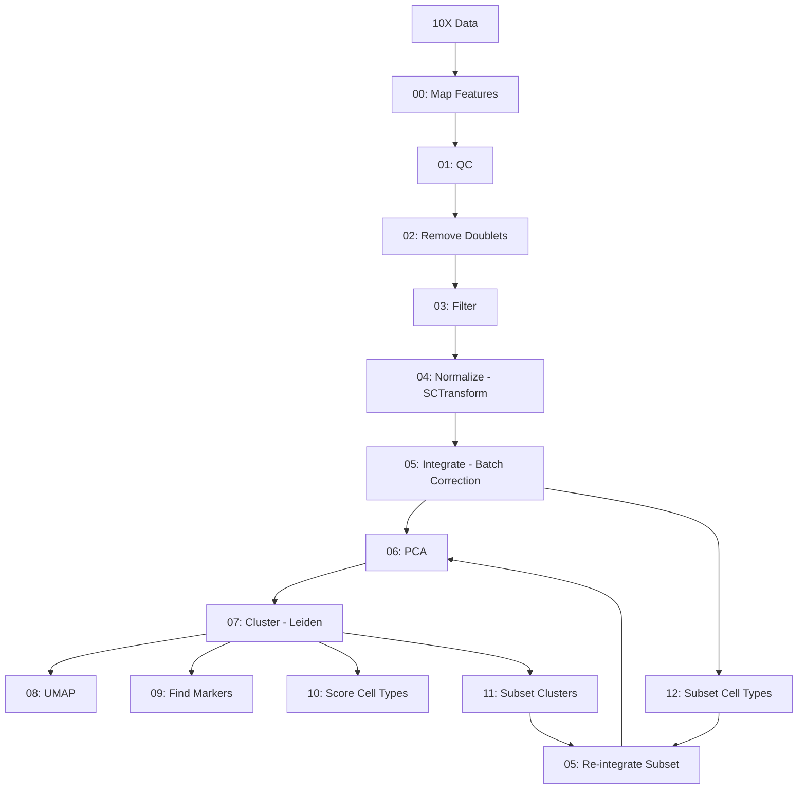

# Seurat Single-Cell RNA-seq Analysis Pipeline

A comprehensive pipeline for processing and analyzing single-cell RNA-seq data from multiple time points using Seurat in R.

## Table of Contents

- [Overview](#overview)
- [Directory Structure](#directory-structure)
- [Prerequisites](#prerequisites)
- [Configuration](#configuration)
- [Pipeline Workflow](#pipeline-workflow)
- [Usage](#usage)
- [Scripts Description](#scripts-description)
- [Output Files](#output-files)
- [Cell Markers File](#cell-markers-file)
- [Citation](#references)

---

## Overview

This pipeline processes 10X Genomics single-cell RNA-seq data through a complete analysis workflow including:

- Quality control and filtering
- Doublet detection and removal
- Normalization using SCTransform
- Batch correction and integration
- Dimensionality reduction (PCA and UMAP)
- Clustering analysis
- Marker gene identification
- Cell type scoring
- Subsetting and re-analysis of specific populations

The pipeline is designed to run on HPC systems using SLURM job scheduling and processes data from multiple experimental time points.

---

## Directory Structure

```
scripts/seurat/
├── README.md                       # This file
├── run_pipeline.sh                 # Main pipeline orchestration script
├── cell_markers.txt                # Cell type marker gene definitions
│
├── Rscripts/                       # R analysis scripts
│   ├── 00_map_features.R           # Map gene IDs to symbols
│   ├── 01_qc.R                     # Quality control metrics and plots
│   ├── 02_remove_doublets.R        # Doublet detection and removal
│   ├── 03_filter.R                 # Cell filtering
│   ├── 04_normalize.R              # SCTransform normalization
│   ├── 05_integrate.R              # Batch correction and integration
│   ├── 05_reintegrate_subset.R     # Re-integrate subset data
│   ├── 06_pca.R                    # Principal component analysis
│   ├── 07_cluster.R                # Graph-based clustering
│   ├── 08_umap.R                   # UMAP dimensionality reduction
│   ├── 09_find_markers.R           # Differential expression analysis
│   ├── 10_score_markers.R          # Cell type scoring
│   ├── 11_subset_clusters.R        # Subset by cluster identity
│   └── 12_subset_cells.R           # Subset by cell type scores
│
└── slurm/                          # SLURM batch scripts
    ├── 01_preprocess.sbatch        # Steps 00-04 (mapping, QC, doublet removal, filtering, normalization)
    ├── 02_integrate.sbatch         # Step 05 (integration)
    ├── 03_cluster.sbatch           # Steps 06-09 (PCA, clustering, UMAP, markers)
    ├── 04_score_markers.sbatch     # Step 10 (cell type scoring)
    ├── 05_subcluster.sbatch        # Step 11 (subset by cluster and re-integrate)
    └── 06_subcells.sbatch          # Step 12 (subset by cell type and re-integrate)
```

---

## Prerequisites

### Software Requirements

- R (tested with v4.5.2)
- SLURM workload manager
- Conda (for environment management)

### R Packages

- Seurat (tested with v5.3.1)
- future (v1.68.0, for parallelization)
- scDblFinder (v1.23.4, for doublet detection)Future (for parallelization)

### Input Data

- **10X Genomics data**: `filtered_feature_bc_matrix` directories for each sample
- **Gene mapping file**: TSV file with columns `gene_id` and `symbol` for ID-to-symbol mapping

---

## Configuration

### Setting up R environment

The pipeline requires specific R packages. Use the provided conda environment file to create a reproducible environment.

**Create environment from yml file**:
```bash
conda env create -f config/env_seurat.yml
```

### Configuration Variables

**Default paths**

The pipeline uses configuration files in the `config/` directory. Default paths are defined in `config/default_paths.sh` and can be overridden in `config/local_paths.sh`.

**Main analysis ID**: Set in `run_pipeline.sh`:
```bash
export main_ID="all"            # Main analysis ID (default: "all")
```

### Input Data Organization

```
$OUT/cellranger/
└── ref_<genome>/
    ├── control/outs/filtered_feature_bc_matrix/
    ├── 3h/outs/filtered_feature_bc_matrix/
    ├── 24h/outs/filtered_feature_bc_matrix/
    └── ...

$REF_FILES/
└── loc_map.tsv                 # Gene ID to symbol mapping (gene_id, symbol)
```

### Configuration of cell type markers

Edit `scripts/seurat/cell_markers.txt` to define cell type markers (see [Cell Markers File](#cell-markers-file) section).

---

## Pipeline Workflow



---

## Usage

### Full Pipeline

```bash
# Navigate to the working directory
cd $WORK

# Run the complete pipeline
bash scripts/seurat/run_pipeline.sh
```

The pipeline will automatically:
1. Submit preprocessing jobs (array job for 8 samples)
2. Wait for completion and integrate samples
3. Perform clustering and analysis
4. Run subsetting workflows

### Running Individual SLURM Scripts

Each SLURM batch script can be run independently with custom parameters:

#### 01_preprocess.sbatch
Processes individual samples through mapping, QC, doublet removal, filtering, and normalization (steps 00-04).

**Parameters**:
- `ID`: Analysis identifier (default: "all")
- `REF`: Reference genome name (default: "UKY_AmexF1_1_genomic")
- `MIN_CELLS`: Minimum cells per gene (default: 5)
- `MIN_FEATURES`: Minimum features per cell (default: 500)
- `MAX_FEATURES`: Maximum features per cell (default: 5000)
- `MIN_COUNTS`: Minimum UMI counts per cell (default: 1000)
- `MAX_COUNTS`: Maximum UMI counts per cell (default: 30000)
- `MAX_MT`: Maximum mitochondrial percentage (default: 10)
- `MAX_RIBO`: Maximum ribosomal percentage (default: 35)

**Usage**:
```bash
# Run with defaults
sbatch scripts/seurat/slurm/01_preprocess.sbatch

# Run with custom parameters
sbatch --export=ALL,ID=test,MIN_COUNTS=2000,MAX_MT=5 scripts/seurat/slurm/01_preprocess.sbatch
```

---

#### 02_integrate.sbatch
Integrates all normalized samples with batch correction (step 05).

**Parameters**:
- `ID`: Analysis identifier (default: "all")

**Usage**:
```bash
# Run with defaults
sbatch scripts/seurat/slurm/02_integrate.sbatch

# Run with custom ID
sbatch --export=ALL,ID=myanalysis scripts/seurat/slurm/02_integrate.sbatch
```

---

#### 03_cluster.sbatch
Performs PCA, clustering, UMAP, and marker identification (steps 06-09).

**Parameters**:
- `ID`: Analysis identifier (default: "all")
- `NPCS`: Number of principal components to compute (default: 50)
- `DIMS`: Number of dimensions for clustering (default: 10)
- `RES`: Clustering resolution (default: 0.5)
- `UMAP_DIMS`: Number of dimensions for UMAP (default: 10)
- `UMAP_METRIC`: Distance metric for UMAP (default: "cosine")
- `SIGNIFICANCE`: p-value threshold for markers (default: 0.05)
- `REGULATION`: Log fold-change threshold (default: 1)
- `ENRICHMENT`: Minimum fraction of cells expressing marker (default: 0.2)
- `TOP_MARKERS`: Number of top markers to keep (default: 100)

**Usage**:
```bash
# Run with defaults
sbatch scripts/seurat/slurm/03_cluster.sbatch

# Run with custom clustering parameters
sbatch --export=ALL,ID=test,DIMS=15,RES=0.8,NPCS=50 scripts/seurat/slurm/03_cluster.sbatch

# Run with stricter marker filtering
sbatch --export=ALL,ID=test,SIGNIFICANCE=0.01,REGULATION=1.5 scripts/seurat/slurm/03_cluster.sbatch
```

---

#### 04_score_markers.sbatch
Scores cells based on cell type marker genes (step 10). Runs as an array job, one task per cell type.

**Parameters**:
- `main_ID`: Main analysis identifier (default: "all")
- `MARKER_FILE`: Path to cell markers file (default: "$WORK/scripts/seurat/cell_markers.txt")

**Usage**:
```bash
# Run with defaults (scores all cell types in cell_markers.txt)
sbatch scripts/seurat/slurm/04_score_markers.sbatch

# Run with custom main_ID
sbatch --export=ALL,main_ID=myanalysis scripts/seurat/slurm/04_score_markers.sbatch

# Run with custom marker file and array size matching number of cell types
sbatch --array=0-5 --export=ALL,MARKER_FILE=/path/to/markers.txt scripts/seurat/slurm/04_score_markers.sbatch
```

**Note**: Use `--array=0-N` where N is one less than the number of cell types in your marker file.

---

#### 05_subcluster.sbatch
Subsets specific clusters and re-integrates for deeper analysis (step 11).

**Parameters**:
- `main_ID`: Main analysis identifier (default: "all")
- `ID`: Subset identifier (default: "cluster1")
- `IDENT`: Cluster identity/identities to subset (default: "1")

**Usage**:
```bash
# Subset cluster 5
sbatch --export=ALL,main_ID=all,ID=cluster5,IDENT=5 scripts/seurat/slurm/05_subcluster.sbatch

# Subset multiple clusters (comma-separated)
sbatch --export=ALL,main_ID=all,ID=clusters_1_2_3,IDENT="1,2,3" scripts/seurat/slurm/05_subcluster.sbatch
```

---

#### 06_subcells.sbatch
Subsets cells based on marker expression scores and re-integrates (step 12).

**Parameters**:
- `main_ID`: Main analysis identifier (default: "all")
- `ID`: Subset identifier (default: "enriched")
- `MODE`: Subsetting mode - "remove" or "keep" (default: "remove")
- `CELL_TYPES`: Semicolon-separated cell type names (default: "epithelial")
- `CELL_THRESHOLDS`: Semicolon-separated score thresholds (default: "1.0")
- `MARKER_FILE`: Path to cell markers file (default: "$WORK/scripts/seurat/cell_markers.txt")

**Usage**:
```bash
# Remove cells with high epithelial scores (filter out unwanted population)
sbatch --export=ALL,main_ID=all,ID=no_epi,MODE=remove,CELL_TYPES=Epithelial,CELL_THRESHOLDS=0.5 scripts/seurat/slurm/06_subcells.sbatch

# Keep cells with high macrophage scores (enrich for target population)
sbatch --export=ALL,main_ID=all,ID=enriched_macrophages,MODE=keep,CELL_TYPES=Macrophage,CELL_THRESHOLDS=1.0 scripts/seurat/slurm/06_subcells.sbatch

# Filter multiple cell types
sbatch --export=ALL,main_ID=all,ID=filtered,MODE=remove,CELL_TYPES="Epithelial;Erythrocytes",CELL_THRESHOLDS="0.5;3.0" scripts/seurat/slurm/06_subcells.sbatch
```

**Note**: Cell type names must match those defined in `cell_markers.txt`.

---

### Running Individual R Scripts

Each R script can also be run independently:

```bash
# Example: Run QC on a single sample
Rscript scripts/seurat/Rscripts/01_qc.R <sample_id> <output_dir> <input_rds>

# Example: Run integration
Rscript scripts/seurat/Rscripts/05_integrate.R <analysis_id> <output_dir> sample1.rds sample2.rds ...
```

---

## Scripts Description

### Core Pipeline Scripts

#### 00_map_features.R
**Purpose**: Convert Ensembl gene IDs to gene symbols using a mapping file.

**Parameters**:
- `min_cells = 5`: Keep genes detected in ≥5 cells
- `min_features = 500`: Keep cells with ≥500 genes

**Usage**: `Rscript 00_map_features.R <id> <outdir> <input_dir> <mapping_tsv> <min_cells> <min_features>`

**Output**: `<id>_mapped.rds`, `<id>_mapping_summary.tsv`

---

#### 01_qc.R
**Purpose**: Generate comprehensive QC metrics and visualizations.

**Metrics Calculated**:
- `percent.mt`: Mitochondrial gene percentage
- `percent.ribo`: Ribosomal gene percentage
- `percent.rrna`: rRNA percentage
- `percent.trna`: tRNA percentage
- `log10UMIsPerGene`: Library complexity

**Usage**: `Rscript 01_qc.R <id> <outdir> <input_rds>`

**Output**:
- QC plots (violin, histogram, density, scatter plots) as PNG and PDF

**Note**: QC plots do not show threshold lines - they are purely exploratory to help determine appropriate filtering thresholds.

---

#### 02_remove_doublets.R
**Purpose**: Detect and remove doublets (multiplets) using scDblFinder.

**Method**: Uses the scDblFinder algorithm to identify and remove doublet cells that result from capturing two or more cells in a single droplet.

**Usage**: `Rscript 02_remove_doublets.R <id> <outdir> <input_rds>`

**Output**:
- `<id>_DB_removed.rds`: Seurat object with doublets removed
- `<id>_DB_removed_summary.tsv`: Summary statistics

---

#### 03_filter.R
**Purpose**: Filter cells based on QC thresholds.

**Usage**: `Rscript 03_filter.R <id> <outdir> <input_rds> <min_counts> <max_counts> <min_features> <max_features> <max_mt> <max_ribo>`

**Output**:
- `<id>_filtered.rds`
- `<id>_filtering_summary.tsv`
- QC plots with red dashed threshold lines

**Note**: Unlike QC plots, filtering plots show red dashed lines indicating the thresholds being applied.

---

#### 04_normalize.R
**Purpose**: Normalize data using SCTransform method.

**Parameters**:
- `ncells = 5000`: Number of cells for model training
- `variable.features.n = 3000`: Number of variable features

**Usage**: `Rscript 04_normalize.R <id> <outdir> <input_rds>`

**Output**:
- `<id>_normalized.rds`
- `<id>_normalization_summary.tsv`

---

#### 05_integrate.R
**Purpose**: Integrate multiple samples with batch correction.

**Method**: SCTransform-based integration using CCA anchors

**Parameters**:
- `nfeatures = 3000`: Number of integration features

**Usage**: `Rscript 05_integrate.R <id> <outdir> <sample1.rds> <sample2.rds> ...`

**Output**:
- `<id>_integrated.rds`-
- `<id>_integration_summary.tsv`

#### 05_reintegrate_subset.R
**Purpose**: Re-normalize and re-integrate a subset of cells.

**Method**: Splits subset by sample, re-runs SCTransform on each, and performs integration. If any sample has <30 cells, integration is skipped and SCTransform is run on the entire subset>

**Usage**: `Rscript 05_reintegrate_subset.R <id> <outdir> <input_rds>`

**Output**:
- `<id>_integrated.rds`
- `<id>_integration_summary.tsv`

---

#### 06_pca.R
**Purpose**: Perform principal component analysis.

**Usage**: `Rscript 06_pca.R <id> <outdir> <input_rds> <npcs>`

**Output**:
- `<id>_06_pca.rds`
- `<id>_06_pca_elbow.png`
- `<id>_06_pca_summary.tsv`

---

#### 07_cluster.R
**Purpose**: Graph-based clustering using Leiden algorithm.

**Parameters**:
- `algorithm = 4`: Leiden clustering

**Usage**: `Rscript 07_cluster.R <id> <outdir> <input_rds> <dims> <res>`

**Output**:
- `<id>_07_clustered.rds`
- `<id>_07_clustering_summary.tsv`

---

#### 08_umap.R
**Purpose**: UMAP dimensionality reduction for visualization.

**Usage**: `Rscript 08_umap.R <id> <outdir> <input_rds> <dims> <metric>`

**Output**:
- `<id>_08_umap.rds`
- `<id>_08_umap.png`-
- `<id>_08_umap_summary.tsv`

---

#### 09_find_markers.R
**Purpose**: Identify cluster-specific marker genes.

**Parameters**:
- `max.cells.per.ident = 500`: Downsample cells per cluster
- `only.pos = FALSE`: Find both up and down-regulated markers

**Usage**: `Rscript 09_find_markers.R <id> <outdir> <input_rds> <significance> <regulation> <enrichment> <top>`

**Output**:
- `<id>_markers.tsv`: All markers
- `<id>_markers_filtered.tsv`: Filtered top markers

---

#### 10_score_markers.R
**Purpose**: Score cells based on cell type markers and visualize expression patterns.

**Method**: Calculates module scores using AddModuleScore and generates comprehensive visualizations grouped by both timepoints and clusters.

**Usage**: `Rscript 10_score_markers.R <id> <outdir> <input_rds> <cell_name> <markers>`

**Output**:
- `<id>_scored.rds`: Object with added module score
- `<id>_all_timepoints_violin_score.png`: Violin plot grouped by timepoint
- `<id>_all_clusters_violin_score.png`: Violin plot grouped by cluster
- `<id>_<marker>_timepoints_violin_score.png`: Individual marker expression by timepoint
- `<id>_<marker>_clusters_violin_score.png`: Individual marker expression by cluster
- `<id>_all_score_distribution.png`: Score distribution histogram
- `<id>_score_summary.tsv`: Summary of available and missing markers

---

#### 11_subset_clusters.R
**Purpose**: Subset data to specific clusters for focused re-analysis.

**Usage**: `Rscript 11_subset_clusters.R <id> <outdir> <input_rds> <cluster_ident>`

**Output**:
- `<id>_subset.rds`
- `<id>_subsetting_summary.tsv`

---

#### 12_subset_cells.R
**Purpose**: Filter cells based on cell type marker expression scores with two modes.

**Modes**:
- **"remove" mode**: Keeps cells where ALL scores are below threshold (filters OUT high-scoring cells from unwanted populations)
- **"keep" mode**: Keeps cells where AT LEAST ONE score is above threshold (enriches FOR cells expressing target markers)

**Usage**: `Rscript 12_subset_cells.R <id> <outdir> <input_rds> <mode> <cell_types> <cell_markers> <cell_thresholds>`

**Arguments Format**:
- `mode`: Either remove or keep
- `cell_types`: Semicolon-separated (e.g., Epithelial;Erythrocytes)
- `cell_markers`: Semicolon-separated lists, comma-separated within (e.g., KRT8,KRT18;HBA1,HBB)
- `cell_thresholds`: Semicolon-separated values (e.g., 0.5;3.0)

**Output**:
- `<id>_subset.rds`: Filtered object
- `<id>_<celltype>_score_distribution.png`: Score distribution histogram per cell type
- `<id>_<celltype>_violin_score.png`: Violin plot by timepoint per cell type
- `<id>_subsetting_summary.tsv`: Summary statistics including cells kept/removed per cell type

---

## Output Files

### File Naming Convention

Files follow the pattern: `<analysis_id>_<step_number>_<description>.<extension>` for integrated analysis steps, or `<analysis_id>_<description>.<extension>` for per-sample or subset operations.

Examples:
- `control_mapped.rds` (step 00, per-sample)
- `all_05_integrated.rds` (step 05, integrated samples with main_ID=all)
- `all_07_clustered.rds` (step 07, clustered data)
- `enriched1_subset.rds` (subset operation)

### Output Directory Structure

```
$OUT/seurat/
├── all_00_mapped/
│   └── <sample>_mapped.rds
├── all_01_qc/
│   └── <sample>/
│       └── QC plots and PDFs
├── all_02_DB_removed/
│   └── <sample>/
│       ├── <sample>_DB_removed.rds
│       └── QC plots
├── all_03_filtered/
│   └── <sample>/
│       ├── <sample>_filtered.rds
│       └── QC plots with threshold lines
├── all_04_normalized/
│   └── <sample>_normalized.rds
├── all_05_integrated/
│   ├── all_05_integrated.rds
│   └── all_05_integration_summary.tsv
├── all_06_pca/
│   ├── all_06_pca.rds
│   ├── all_06_pca_elbow.png
│   └── all_06_pca_summary.tsv
├── all_07_clustered/
│   ├── all_07_clustered.rds
│   └── all_07_clustering_summary.tsv
├── all_08_umap/
│   ├── all_08_umap.rds
│   ├── all_08_umap.png
│   └── all_08_umap_summary.tsv
├── all_09_markers/
│   ├── all_markers.tsv
│   └── all_markers_filtered.tsv
├── all_10_scored/
│   ├── <celltype>_scored.rds
│   ├── <celltype>_all_timepoints_violin_score.png
│   ├── <celltype>_all_clusters_violin_score.png
│   ├── <celltype>_<marker>_timepoints_violin_score.png
│   ├── <celltype>_<marker>_clusters_violin_score.png
│   ├── <celltype>_all_score_distribution.png
│   └── <celltype>_score_summary.tsv
├── all_cluster15_subset/
│   ├── all_cluster15_subset.rds
│   ├── all_cluster15_subsetting_summary.tsv
│   ├── all_cluster15_05_integrated.rds
│   └── all_cluster15_05_integration_summary.tsv
└── enriched1/
    ├── enriched1_subset.rds
    ├── enriched1_<celltype>_score_distribution.png
    ├── enriched1_<celltype>_violin_score.png
    ├── enriched1_subsetting_summary.tsv
    ├── enriched1_05_integrated.rds
    └── enriched1_05_integration_summary.tsv
```

### Key Output Files

| File | Description |
|------|-------------|
| `*_mapped.rds` | Seurat object with mapped gene symbols |
| `*_DB_removed.rds` | Seurat object with doublets removed |
| `*_filtered.rds` | Quality-filtered Seurat object |
| `*_normalized.rds` | SCTransform-normalized object |
| `*_integrated.rds` | Batch-corrected integrated object |
| `*_clustered.rds` | Clustered object with cell identities |
| `*_markers.tsv` | Differentially expressed genes per cluster |
| `*_scored.rds` | Object with cell type scores added |
| `*_subset.rds` | Subset object (by cluster or cell type) |
| `*_summary.tsv` | Summary statistics for each step |

---

## Cell Markers File

The `cell_markers.txt` file defines cell type markers used for scoring in step 10 and subsetting in step 12.

**Format**: Each line defines one cell type with the format:
```
CELL_TYPE_NAME="GENE1,GENE2,GENE3,..."
```

**Usage in pipeline**:
- Step 10 (04_score_markers.sbatch): Runs as an array job, processing each cell type
- Step 12 (06_subcells.sbatch): Uses specified cell types for subsetting based on MODE

**Notes**:
- Cell type names should not contain spaces
- Genes are comma-separated with no spaces
- Scripts automatically check which markers are available in the dataset
- Missing markers are reported in summary files but do not cause failures

---

## Citation

- **Seurat**: Hao, Y., Stuart, T., Kowalski, M.H., Choudhary, S., Hoffman, P., Hartman, A., Srivastava, A., Molla, G., Madad, S., Fernandez-Granda, C., & Satija, R. (2024). Dictionary learning for integrative, multimodal and scalable single-cell analysis. *Nature Biotechnology, 42*, 293-304. https://doi.org/10.1038/s41587-023-01767-y

- **scDblFinder**: Germain, P.L., Lun, A., Garcia Meixide, C., Macnair, W., & Robinson, M.D. (2022). Doublet identification in single-cell sequencing data using scDblFinder. *F1000Research, 10*, 979. https://doi.org/10.12688/f1000research.73600.2

- **SCTransform**: Hafemeister, C., & Satija, R. (2019). Normalization and variance stabilization of single-cell RNA-seq data using regularized negative binomial regression. *Genome Biology, 20*, 296. https://doi.org/10.1186/s13059-019-1874-1

- **Future package**: Bengtsson, H. (2021). A unifying framework for parallel and distributed processing in R using futures. *The R Journal, 13*(2), 208-227. https://doi.org/10.32614/RJ-2021-048

---

**Last Updated**: 2025-12-09
