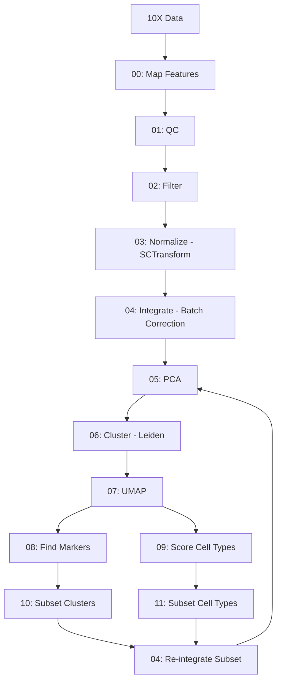

# Seurat Single-Cell RNA-seq Analysis Pipeline

A comprehensive pipeline for processing and analyzing single-cell RNA-seq data from multiple time points using Seurat in R.

## Table of Contents

- [Overview](#overview)
- [Directory Structure](#directory-structure)
- [Prerequisites](#prerequisites)
- [Installation](#installation)
- [Pipeline Workflow](#pipeline-workflow)
- [Usage](#usage)
- [Scripts Description](#scripts-description)
- [Output Files](#output-files)
- [Citation](#references)

## Overview

This pipeline processes 10X Genomics single-cell RNA-seq data through a complete analysis workflow including:

- Quality control and filtering
- Normalization using SCTransform
- Batch correction and integration
- Dimensionality reduction (PCA and UMAP)
- Clustering analysis
- Marker gene identification
- Cell type scoring
- Subsetting and re-analysis of specific populations

The pipeline is designed to run on HPC systems using SLURM job scheduling and processes data from multiple experimental time points.

## Directory Structure

```
scripts/seurat/
├── README.md                       # This file
├── run_pipeline.sh                 # Main pipeline orchestration script
│
├── R Scripts (Analysis Steps)
├── 00_map_features.R               # Map gene IDs to symbols
├── 01_qc.R                         # Quality control metrics and plots
├── 02_filter.R                     # Cell filtering
├── 03_normalize.R                  # SCTransform normalization
├── 04_integrate.R                  # Batch correction and integration
├── 04_reintegrate_subset.R         # Re-integrate subset data
├── 05_pca.R                        # Principal component analysis
├── 06_cluster.R                    # Graph-based clustering
├── 07_umap.R                       # UMAP dimensionality reduction
├── 08_find_markers.R               # Differential expression analysis
├── 09_score_markers.R              # Cell type scoring (Schwann cells)
├── 10_subset_clusters.R            # Subset by cluster identity
├── 11_subset_cells.R               # Subset by cell type scores
│
└── slurm/                          # SLURM batch scripts
    ├── 01_preprocess.sbatch        # Steps 00-03 (mapping, QC, filtering, normalization)
    ├── 02_integrate.sbatch         # Step 04 (integration)
    ├── 03_cluster.sbatch           # Steps 05-09 (PCA, clustering, UMAP, markers)
    ├── 04_subcluster.sbatch        # Subset by cluster and re-integrate
    └── 05_subcells.sbatch          # Subset by cell type and re-integrate
```

## Prerequisites

### R Packages

- Seurat
- ggplot2
- dplyr
- future (for parallelization)

### Input Data

- **10X Genomics data**: `filtered_feature_bc_matrix` directories for each sample
- **Gene mapping file**: TSV file with columns `gene_id` and `symbol` for ID-to-symbol mapping

## Installation

### 1. Configure paths

Edit `run_pipeline.sh` to set your directory paths:

```bash
DATA="/path/to/your/data"       # Base data directory
LOG="/path/to/logs"		# Logs directory
WORK="/path/to/root"  		# Working directory
TSV="/path/to/loc_map.tsv"	# Gene mapping file
OUT="/path/to/out"		# Seurat outputs directory

```

### 2. Prepare input data

Ensure your data is organized as:
```
$DATA/output/
└── outputs/
    └── cellranger/
        ├── control/outs/filtered_feature_bc_matrix/
        ├── 3h/outs/filtered_feature_bc_matrix/
        ├── 24h/outs/filtered_feature_bc_matrix/
        └── ...
```

## Pipeline Workflow



## Usage

### Quick Start (Full Pipeline)

```bash
# Navigate to the working directory
cd $WORK

# Run the complete pipeline
bash scripts/seurat/run_pipeline.sh
```

The pipeline will automatically:
1. Submit preprocessing jobs (array job for 8 samples)
2. Wait for completion and integrate samples
3. Perform clustering and analysis
4. Optionally run subsetting workflows

### Running Individual Steps

Each R script can be run independently:

```bash
# Example: Run QC on a single sample
Rscript scripts/seurat/01_qc.R <sample_id> <output_dir> <input_rds>

# Example: Run integration
Rscript scripts/seurat/04_integrate.R <analysis_id> <output_dir> sample1.rds sample2.rds ...
```

## Scripts Description

### Core Pipeline Scripts

#### 00_map_features.R
**Purpose**: Convert Ensembl gene IDs to gene symbols using a mapping file.

**Parameters**:
- `min_cells = 5`: Keep genes detected in ≥5 cells
- `min_features = 500`: Keep cells with ≥500 genes

**Usage**: `Rscript 00_map_features.R <id> <outdir> <input_dir> <mapping_tsv>`

**Output**: `<id>_mapped.rds`, `<id>_mapping_summary.tsv`

---

#### 01_qc.R
**Purpose**: Generate comprehensive QC metrics and visualizations.

**Metrics Calculated**:
- `percent.mt`: Mitochondrial gene percentage
- `percent.ribo`: Ribosomal gene percentage
- `percent.rrna`: rRNA percentage
- `percent.trna`: tRNA percentage
- `log10UMIsPerGene`: Library complexity

**Usage**: `Rscript 01_qc.R <id> <outdir> <input_rds>`

**Output**: QC plots (violin, histogram, density, scatter plots) as PNG and PDF

---

#### 02_filter.R
**Purpose**: Filter cells based on QC thresholds.

**Default Thresholds**:
- `min_counts = 1000`: Minimum UMI counts
- `max_counts = 30000`: Maximum UMI counts
- `min_features = 500`: Minimum genes detected
- `max_features = 5000`: Maximum genes detected
- `max_mt = 10`: Maximum mitochondrial %
- `max_ribo = 30`: Maximum ribosomal %

**Usage**: `Rscript 02_filter.R <id> <outdir> <input_rds>`

**Output**: `<id>_filtered.rds`, `<id>_filtering_summary.tsv`, QC plots

---

#### 03_normalize.R
**Purpose**: Normalize data using SCTransform method.

**Parameters**:
- `ncells = 5000`: Number of cells for model training
- `variable.features.n = 3000`: Number of variable features

**Usage**: `Rscript 03_normalize.R <id> <outdir> <input_rds>`

**Output**: `<id>_normalized.rds`, `<id>_normalization_summary.tsv`

---

#### 04_integrate.R
**Purpose**: Integrate multiple samples with batch correction.

**Method**: SCTransform-based integration using CCA anchors

**Parameters**:
- `nfeatures = 3000`: Number of integration features

**Usage**: `Rscript 04_integrate.R <id> <outdir> <sample1.rds> <sample2.rds> ...`

**Output**: `<id>_04_integrated.rds`, `<id>_04_integration_summary.tsv`

---

#### 05_pca.R
**Purpose**: Perform principal component analysis.

**Parameters**:
- `npcs = 50`: Number of PCs to compute

**Usage**: `Rscript 05_pca.R <id> <outdir> <input_rds>`

**Output**: `<id>_05_pca.rds`, `<id>_05_pca_elbow.png`, `<id>_05_pca_summary.tsv`

---

#### 06_cluster.R
**Purpose**: Graph-based clustering using Leiden algorithm.

**Parameters**:
- `dims = 10`: Number of PCs to use
- `res = 0.5`: Clustering resolution
- `algorithm = 4`: Leiden clustering

**Usage**: `Rscript 06_cluster.R <id> <outdir> <input_rds>`

**Output**: `<id>_06_clustered.rds`, `<id>_06_clustering_summary.tsv`

---

#### 07_umap.R
**Purpose**: UMAP dimensionality reduction for visualization.

**Parameters**:
- `dims = 10`: Number of PCs to use
- `metric = "cosine"`: Distance metric
- `seed = 777`: Random seed for reproducibility

**Usage**: `Rscript 07_umap.R <id> <outdir> <input_rds>`

**Output**: `<id>_07_umap.rds`, `<id>_07_umap.png`, `<id>_07_umap_summary.tsv`

---

#### 08_find_markers.R
**Purpose**: Identify cluster-specific marker genes.

**Parameters**:
- `max.cells.per.ident = 500`: Downsample cells per cluster
- `only.pos = FALSE`: Find both up and down-regulated markers
- `significance = 0.05`: Adjusted p-value threshold
- `regulation = 1`: Log2FC threshold
- `enrichment = 0.2`: Difference in detection rate (pct.1 - pct.2)
- `top = 30`: Top markers per cluster per direction

**Usage**: `Rscript 08_find_markers.R <id> <outdir> <input_rds>`

**Output**:
- `<id>_08_markers.tsv`: All markers
- `<id>_08_markers_filtered.tsv`: Filtered top markers

---

#### 09_score_markers.R
**Purpose**: Score cells based on cell type markers (Schwann cells).

**Default Schwann Markers**:
```r
markers <- c("SOX10", "S100", "S100B", "NGFR", "p75NTR", "MPZ", "MBP",
             "PMP22", "PLP1", "PRX", "NCAM", "NCAM1", "L1CAM", "SCN7A",
             "SOX2", "GAP43", "EGR2", "Krox20", "POU3F1", "OCT6")
```

**Usage**: `Rscript 09_score_markers.R <id> <outdir> <input_rds>`

**Output**:
- `<id>_09_scored.rds`: Object with added score
- Feature plots, violin plots, individual marker plots
- `<id>_09_score_summary.tsv`

---

#### 10_subset_clusters.R
**Purpose**: Subset data to specific clusters.

**Usage**: `Rscript 10_subset_clusters.R <id> <outdir> <input_rds> <cluster_ids>`

**Output**: `<id>_00_subset.rds`, `<id>_00_subsetting_summary.tsv`

---

#### 11_subset_cells.R
**Purpose**: Remove epithelial and erythrocyte contamination.

**Parameters**:
- `epi_thr = 0.5`: Epithelial score threshold
- `ery_thr = 3.0`: Erythrocyte score threshold

**Markers**:
- **Epithelial**: KRT8, KRT18, KRT1, EPCAM, CLDN7, CDH1, DSP, DSG2, EPPK1, S100P
- **Erythrocyte**: HBA1, HBB, HBA2, HEMGN, ALAS2, PRDX2, ANK1, HBBP1

**Usage**: `Rscript 11_subset_cells.R <id> <outdir> <input_rds>`

**Output**:
- `<id>_00_subset.rds`: Filtered object
- Score distribution plots
- `<id>_00_subsetting_summary.tsv`

---

#### 04_reintegrate_subset.R
**Purpose**: Re-normalize and re-integrate subset data.

**Usage**: `Rscript 04_reintegrate_subset.R <id> <outdir> <input_rds>`

**Output**: `<id>_04_integrated.rds`, `<id>_04_integration_summary.tsv`

## Output Files

### File Naming Convention

Files follow the pattern: `<analysis_id>_<step_number>_<description>.<extension>`

Example: `main_04_integrated.rds`

### Output Directory Structure

```
results/seurat/
├── <id>_00_mapped/
│   └── <sample>_mapped.rds
├── <id>_01_qc/
│   └── <sample>/
│       └── QC plots and PDFs
├── <id>_02_filtered/
│   └── <sample>/
│       ├── <sample>_filtered.rds
│       └── QC plots
├── <id>_03_normalized/
│   └── <sample>_normalized.rds
├── <id>_04_integrated.rds
├── <id>_05_pca.rds
├── <id>_06_clustered.rds
├── <id>_07_umap.rds
├── <id>_08_markers.tsv
├── <id>_08_markers_filtered.tsv
└── <id>_09_scored.rds
```

### Key Output Files

| File | Description |
|------|-------------|
| `*_mapped.rds` | Seurat object with mapped gene symbols |
| `*_filtered.rds` | Quality-filtered Seurat object |
| `*_normalized.rds` | SCTransform-normalized object |
| `*_integrated.rds` | Batch-corrected integrated object |
| `*_clustered.rds` | Clustered object with cell identities |
| `*_markers.tsv` | Differentially expressed genes per cluster |
| `*_scored.rds` | Object with cell type scores added |
| `*_summary.tsv` | Summary statistics for each step |

---

## Citation

If you use this pipeline, please cite:

- **Seurat**: Hao et al. (2021). Integrated analysis of multimodal single-cell data. Cell.
- **SCTransform**: Hafemeister & Satija (2019). Normalization and variance stabilization of single-cell RNA-seq data using regularized negative binomial regression. Genome Biology.

---

## Contact

For questions or issues with this pipeline, please contact the repository maintainer.

**Last Updated**: 2025-11-19
