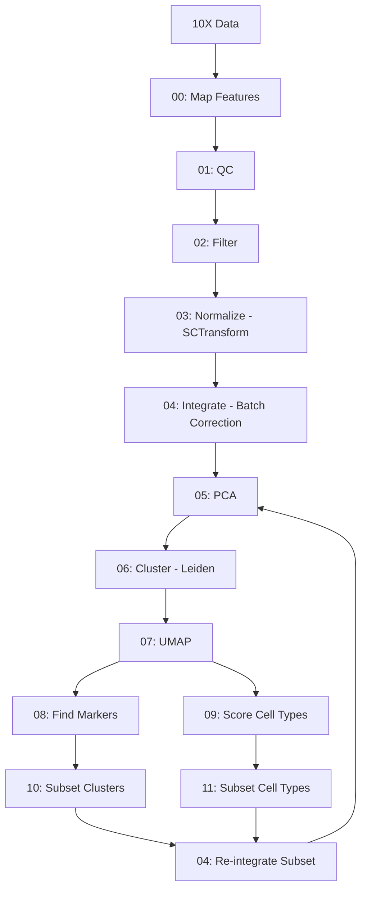

# Seurat Single-Cell RNA-seq Analysis Pipeline

A comprehensive pipeline for processing and analyzing single-cell RNA-seq data from multiple time points using Seurat in R.

## Table of Contents

- [Overview](#overview)
- [Directory Structure](#directory-structure)
- [Prerequisites](#prerequisites)
- [Installation](#installation)
- [Pipeline Workflow](#pipeline-workflow)
- [Usage](#usage)
- [Scripts Description](#scripts-description)
- [Parameters](#parameters)
- [Output Files](#output-files)
- [Advanced Usage](#advanced-usage)
- [Troubleshooting](#troubleshooting)

## Overview

This pipeline processes 10X Genomics single-cell RNA-seq data through a complete analysis workflow including:

- Quality control and filtering
- Normalization using SCTransform
- Batch correction and integration
- Dimensionality reduction (PCA and UMAP)
- Clustering analysis
- Marker gene identification
- Cell type scoring
- Subsetting and re-analysis of specific populations

The pipeline is designed to run on HPC systems using SLURM job scheduling and processes data from multiple experimental time points: control, 3h, 24h, 72h, 7dpa, 14dpa, 22dpa, and 33dpa.

## Directory Structure

```
scripts/seurat/
├── README.md                        # This file
├── run_pipeline.sh                  # Main pipeline orchestration script
│
├── R Scripts (Analysis Steps)
├── 00_map_features.R               # Map gene IDs to symbols
├── 01_qc.R                         # Quality control metrics and plots
├── 02_filter.R                     # Cell filtering
├── 03_normalize.R                  # SCTransform normalization
├── 04_integrate.R                  # Batch correction and integration
├── 04_reintegrate_subset.R         # Re-integrate subset data
├── 05_pca.R                        # Principal component analysis
├── 06_cluster.R                    # Graph-based clustering
├── 07_umap.R                       # UMAP dimensionality reduction
├── 08_find_markers.R               # Differential expression analysis
├── 09_score_markers.R              # Cell type scoring (Schwann cells)
├── 10_subset_clusters.R            # Subset by cluster identity
├── 11_subset_cells.R               # Subset by cell type scores
│
└── slurm/                          # SLURM batch scripts
    ├── 01_preprocess.sbatch        # Steps 00-03 (mapping, QC, filtering, normalization)
    ├── 02_integrate.sbatch         # Step 04 (integration)
    ├── 03_cluster.sbatch           # Steps 05-09 (PCA, clustering, UMAP, markers)
    ├── 04_subcluster.sbatch        # Subset by cluster and re-integrate
    └── 05_subcells.sbatch          # Subset by cell type and re-integrate
```

## Prerequisites

### Software Requirements

- **R** (version ≥ 4.0)
- **Conda/Miniconda** for environment management
- **SLURM** workload manager (for HPC execution)

### R Packages

- Seurat (≥ 4.0)
- ggplot2
- dplyr
- future (for parallelization)

### Input Data

- **10X Genomics data**: `filtered_feature_bc_matrix` directories for each sample
- **Gene mapping file**: TSV file with columns `gene_id` and `symbol` for ID-to-symbol mapping

## Installation

### 1. Set up Conda environment

```bash
# Create a new conda environment
conda create -n seurat -c conda-forge -c bioconda r-base r-seurat r-ggplot2 r-dplyr r-future

# Activate the environment
conda activate seurat
```

### 2. Configure paths

Edit `run_pipeline.sh` to set your directory paths:

```bash
DATA="/path/to/your/data"           # Base data directory
SCRATCH="/path/to/scratch"          # Scratch directory for logs
WORK="$HOME/BINF7700_Capstone"      # Working directory
```

### 3. Prepare input data

Ensure your data is organized as:
```
$DATA/
├── cellranger/
│   ├── control/outs/filtered_feature_bc_matrix/
│   ├── 3h/outs/filtered_feature_bc_matrix/
│   ├── 24h/outs/filtered_feature_bc_matrix/
│   └── ...
└── ref_genomes/ref_files/
    └── loc_map.tsv
```

## Pipeline Workflow



## Usage

### Quick Start (Full Pipeline)

```bash
# Navigate to the working directory
cd $HOME/BINF7700_Capstone

# Run the complete pipeline
bash scripts/seurat/run_pipeline.sh
```

The pipeline will automatically:
1. Submit preprocessing jobs (array job for 8 samples)
2. Wait for completion and integrate samples
3. Perform clustering and analysis
4. Optionally run subsetting workflows

### Running Individual Steps

Each R script can be run independently:

```bash
# Example: Run QC on a single sample
Rscript scripts/seurat/01_qc.R <sample_id> <output_dir> <input_rds>

# Example: Run integration
Rscript scripts/seurat/04_integrate.R <analysis_id> <output_dir> sample1.rds sample2.rds ...
```

### Submitting SLURM Jobs Manually

```bash
# Set required environment variables
export ID=""                        # Main analysis ID
export OUT="/path/to/output"        # Output directory
export RESULT="/path/to/cellranger" # CellRanger results
export WORK="$HOME/BINF7700_Capstone"
export SMPS=("control" "3h" "24h" "72h" "7dpa" "14dpa" "22dpa" "33dpa")
export TSV="/path/to/loc_map.tsv"

# Submit preprocessing (array job for all samples)
sbatch --export=ALL scripts/seurat/slurm/01_preprocess.sbatch

# Submit integration (after preprocessing completes)
sbatch --export=ALL scripts/seurat/slurm/02_integrate.sbatch

# Submit clustering (after integration completes)
sbatch --export=ALL scripts/seurat/slurm/03_cluster.sbatch
```

## Scripts Description

### Core Pipeline Scripts

#### 00_map_features.R
**Purpose**: Convert Ensembl gene IDs to gene symbols using a mapping file.

**Parameters**:
- `min_cells = 5`: Keep genes detected in ≥5 cells
- `min_features = 500`: Keep cells with ≥500 genes

**Usage**: `Rscript 00_map_features.R <id> <outdir> <input_dir> <mapping_tsv>`

**Output**: `<id>_mapped.rds`, `<id>_mapping_summary.tsv`

---

#### 01_qc.R
**Purpose**: Generate comprehensive QC metrics and visualizations.

**Metrics Calculated**:
- `percent.mt`: Mitochondrial gene percentage
- `percent.ribo`: Ribosomal gene percentage
- `percent.rrna`: rRNA percentage
- `percent.trna`: tRNA percentage
- `log10UMIsPerGene`: Library complexity

**Usage**: `Rscript 01_qc.R <id> <outdir> <input_rds>`

**Output**: QC plots (violin, histogram, density, scatter plots) as PNG and PDF

---

#### 02_filter.R
**Purpose**: Filter cells based on QC thresholds.

**Default Thresholds**:
- `min_counts = 1000`: Minimum UMI counts
- `max_counts = 30000`: Maximum UMI counts
- `min_features = 500`: Minimum genes detected
- `max_features = 5000`: Maximum genes detected
- `max_mt = 10`: Maximum mitochondrial %
- `max_ribo = 30`: Maximum ribosomal %

**Usage**: `Rscript 02_filter.R <id> <outdir> <input_rds>`

**Output**: `<id>_filtered.rds`, `<id>_filtering_summary.tsv`, QC plots

---

#### 03_normalize.R
**Purpose**: Normalize data using SCTransform method.

**Parameters**:
- `ncells = 5000`: Number of cells for model training
- `variable.features.n = 3000`: Number of variable features

**Usage**: `Rscript 03_normalize.R <id> <outdir> <input_rds>`

**Output**: `<id>_normalized.rds`, `<id>_normalization_summary.tsv`

---

#### 04_integrate.R
**Purpose**: Integrate multiple samples with batch correction.

**Method**: SCTransform-based integration using CCA anchors

**Parameters**:
- `nfeatures = 3000`: Number of integration features

**Usage**: `Rscript 04_integrate.R <id> <outdir> <sample1.rds> <sample2.rds> ...`

**Output**: `<id>_04_integrated.rds`, `<id>_04_integration_summary.tsv`

---

#### 05_pca.R
**Purpose**: Perform principal component analysis.

**Parameters**:
- `npcs = 50`: Number of PCs to compute

**Usage**: `Rscript 05_pca.R <id> <outdir> <input_rds>`

**Output**: `<id>_05_pca.rds`, `<id>_05_pca_elbow.png`, `<id>_05_pca_summary.tsv`

---

#### 06_cluster.R
**Purpose**: Graph-based clustering using Leiden algorithm.

**Parameters**:
- `dims = 10`: Number of PCs to use
- `res = 0.5`: Clustering resolution
- `algorithm = 4`: Leiden clustering

**Usage**: `Rscript 06_cluster.R <id> <outdir> <input_rds>`

**Output**: `<id>_06_clustered.rds`, `<id>_06_clustering_summary.tsv`

---

#### 07_umap.R
**Purpose**: UMAP dimensionality reduction for visualization.

**Parameters**:
- `dims = 10`: Number of PCs to use
- `metric = "cosine"`: Distance metric
- `seed = 777`: Random seed for reproducibility

**Usage**: `Rscript 07_umap.R <id> <outdir> <input_rds>`

**Output**: `<id>_07_umap.rds`, `<id>_07_umap.png`, `<id>_07_umap_summary.tsv`

---

#### 08_find_markers.R
**Purpose**: Identify cluster-specific marker genes.

**Parameters**:
- `max.cells.per.ident = 500`: Downsample cells per cluster
- `only.pos = FALSE`: Find both up and down-regulated markers
- `significance = 0.05`: Adjusted p-value threshold
- `regulation = 1`: Log2FC threshold
- `enrichment = 0.2`: Difference in detection rate (pct.1 - pct.2)
- `top = 30`: Top markers per cluster per direction

**Usage**: `Rscript 08_find_markers.R <id> <outdir> <input_rds>`

**Output**:
- `<id>_08_markers.tsv`: All markers
- `<id>_markers_filtered.tsv`: Filtered top markers

---

#### 09_score_markers.R
**Purpose**: Score cells based on cell type markers (Schwann cells).

**Default Markers**:
```r
markers <- c("SOX10", "S100", "S100B", "NGFR", "p75NTR", "MPZ", "MBP",
             "PMP22", "PLP1", "PRX", "NCAM", "NCAM1", "L1CAM", "SCN7A",
             "SOX2", "GAP43", "EGR2", "Krox20", "POU3F1", "OCT6")
```

**Usage**: `Rscript 09_score_markers.R <id> <outdir> <input_rds>`

**Output**:
- `<id>_09_scored.rds`: Object with added score
- Feature plots, violin plots, individual marker plots
- `<id>_09_score_summary.tsv`

---

#### 10_subset_clusters.R
**Purpose**: Subset data to specific clusters.

**Usage**: `Rscript 10_subset_clusters.R <id> <outdir> <input_rds> <cluster_ids>`

**Example**: `Rscript 10_subset_clusters.R cluster14 output/ data.rds "14"`

**Output**: `<id>_00_subset.rds`, `<id>_00_subsetting_summary.tsv`

---

#### 11_subset_cells.R
**Purpose**: Remove epithelial and erythrocyte contamination.

**Parameters**:
- `epi_thr = 0.5`: Epithelial score threshold
- `ery_thr = 3.0`: Erythrocyte score threshold

**Markers**:
- **Epithelial**: KRT8, KRT18, KRT1, EPCAM, CLDN7, CDH1, DSP, DSG2, EPPK1, S100P
- **Erythrocyte**: HBA1, HBB, HBA2, HEMGN, ALAS2, PRDX2, ANK1, HBBP1

**Usage**: `Rscript 11_subset_cells.R <id> <outdir> <input_rds>`

**Output**:
- `<id>_00_subset.rds`: Filtered object
- Score distribution plots
- `<id>_00_subsetting_summary.tsv`

---

#### 04_reintegrate_subset.R
**Purpose**: Re-normalize and re-integrate subset data.

**Usage**: `Rscript 04_reintegrate_subset.R <id> <outdir> <input_rds>`

**Output**: `<id>_04_integrated.rds`, `<id>_04_integration_summary.tsv`

## Parameters

### Modifying Analysis Parameters

To change parameters, edit the respective R script:

```r
# Example: Change clustering resolution in 06_cluster.R
res <- 0.8  # Change from 0.5 to 0.8 for finer clusters
```

### Customizing Cell Type Markers

Edit marker lists in `09_score_markers.R` or `11_subset_cells.R`:

```r
# Add your own cell type markers
my_markers <- c("GENE1", "GENE2", "GENE3")
```

### Adjusting Resource Allocation

Edit SLURM scripts to change computational resources:

```bash
#SBATCH --cpus-per-task=32    # Reduce from 64
#SBATCH --mem=64G             # Reduce from 128G
#SBATCH --time=02:00:00       # Reduce time
```

## Output Files

### File Naming Convention

Files follow the pattern: `<analysis_id>_<step_number>_<description>.<extension>`

Example: `main_04_integrated.rds`

### Output Directory Structure

```
outputs/seurat/
├── <id>_00_mapped/
│   └── <sample>_mapped.rds
├── <id>_01_qc/
│   └── <sample>/
│       └── QC plots and PDFs
├── <id>_02_filtered/
│   └── <sample>/
│       ├── <sample>_filtered.rds
│       └── QC plots
├── <id>_03_normalized/
│   └── <sample>_normalized.rds
├── <id>_04_integrated.rds
├── <id>_05_pca.rds
├── <id>_06_clustered.rds
├── <id>_07_umap.rds
├── <id>_08_markers.tsv
├── <id>_markers_filtered.tsv
└── <id>_09_scored.rds
```

### Key Output Files

| File | Description |
|------|-------------|
| `*_mapped.rds` | Seurat object with mapped gene symbols |
| `*_filtered.rds` | Quality-filtered Seurat object |
| `*_normalized.rds` | SCTransform-normalized object |
| `*_integrated.rds` | Batch-corrected integrated object |
| `*_clustered.rds` | Clustered object with cell identities |
| `*_markers.tsv` | Differentially expressed genes per cluster |
| `*_scored.rds` | Object with cell type scores added |
| `*_summary.tsv` | Summary statistics for each step |

## Advanced Usage

### Running Custom Subsetting Workflows

#### Subset by Multiple Clusters

```bash
# Subset clusters 5, 10, and 14
export IDENT="5,10,14"
export ID="multi_cluster"

sbatch --export=ALL scripts/seurat/slurm/04_subcluster.sbatch
```

#### Chain Multiple Subsetting Steps

```bash
# First subset by cell type
JOB1=$(sbatch --parsable --export=ALL,ID=step1 slurm/05_subcells.sbatch)

# Then cluster the subset
JOB2=$(sbatch --parsable --export=ALL,ID=step1 --dependency=afterok:$JOB1 slurm/03_cluster.sbatch)

# Then subset again by cluster
JOB3=$(sbatch --parsable --export=ALL,ID=step2,IDENT=2 --dependency=afterok:$JOB2 slurm/04_subcluster.sbatch)
```

### Parallel Processing Configuration

Scripts use the `future` package for parallelization. Adjust in each R script:

```r
# Change number of workers
plan("multicore", workers = 32)  # Use 32 cores instead of 64

# Adjust memory limit
options(future.globals.maxSize = 32000 * 1024^2)  # 32 GB instead of 64 GB
```

### Custom Integration

For integrating specific samples only:

```r
Rscript scripts/seurat/04_integrate.R custom_id output_dir \
    sample1_normalized.rds \
    sample2_normalized.rds \
    sample3_normalized.rds
```

## Troubleshooting

### Common Issues

#### 1. Out of Memory Errors

**Symptoms**: Job killed with exit code 137 or "cannot allocate vector" errors

**Solutions**:
- Increase `--mem` in SLURM scripts
- Reduce `future.globals.maxSize` in R scripts
- Reduce `max.cells.per.ident` in marker finding
- Process samples individually rather than in batches

#### 2. Integration Fails

**Symptoms**: "Cannot find integration anchors" or very few anchors found

**Solutions**:
- Check that samples have sufficient cells (>200 per sample)
- Verify samples passed QC filtering
- Ensure samples have overlapping gene sets
- Try increasing `nfeatures` in integration step

#### 3. Clustering Produces Too Many/Few Clusters

**Symptoms**: Unexpected number of clusters

**Solutions**:
- Adjust `res` parameter in `06_cluster.R`:
  - Decrease (e.g., 0.3) for fewer clusters
  - Increase (e.g., 0.8) for more clusters
- Check elbow plot to ensure correct number of PCs used
- Verify data quality (filtered cells, integration success)

#### 4. Gene Mapping Issues

**Symptoms**: Many unmapped genes or duplicates

**Solutions**:
- Verify mapping file format (tab-separated, headers: gene_id, symbol)
- Check that gene IDs match between data and mapping file
- Review `*_mapping_summary.tsv` for mapping statistics

#### 5. SLURM Job Dependencies Fail

**Symptoms**: Jobs don't start or fail immediately

**Solutions**:
```bash
# Check job status
squeue -u $USER

# Check job details
scontrol show job <job_id>

# Cancel and restart
scancel <job_id>
```

#### 6. Missing Features in Scoring Scripts

**Symptoms**: Warning about missing markers

**Solutions**:
- Check `*_score_summary.tsv` for available markers
- Verify gene naming (uppercase for human, sentence case for mouse)
- Update marker lists to match your organism

### Debugging Tips

1. **Check log files**: SLURM scripts write to `logs/` directory
   ```bash
   tail -f logs/preprocess_*.err
   ```

2. **Test with small data**: Subset data for quick testing
   ```r
   obj <- obj[, sample(ncol(obj), 1000)]  # Use 1000 cells
   ```

3. **Run interactively**: Test R scripts in interactive R session
   ```bash
   srun --pty --mem=32G --cpus-per-task=8 R
   ```

4. **Verify inputs**: Check that input files exist and are readable
   ```bash
   ls -lh $OUT/*.rds
   file $OUT/*.rds
   ```

5. **Monitor resources**: Check memory and CPU usage
   ```bash
   sstat -j <job_id> --format=JobID,MaxRSS,MaxVMSize,AveCPU
   ```

### Getting Help

- Check R session warnings: `warnings()`
- Verify Seurat object structure: `print(obj)`
- Examine metadata: `head(obj@meta.data)`
- Review summary files generated at each step

---

## Citation

If you use this pipeline, please cite:

- **Seurat**: Hao et al. (2021). Integrated analysis of multimodal single-cell data. Cell.
- **SCTransform**: Hafemeister & Satija (2019). Normalization and variance stabilization of single-cell RNA-seq data using regularized negative binomial regression. Genome Biology.

---

## Contact

For questions or issues with this pipeline, please contact the repository maintainer.

**Last Updated**: 2025-11-19
